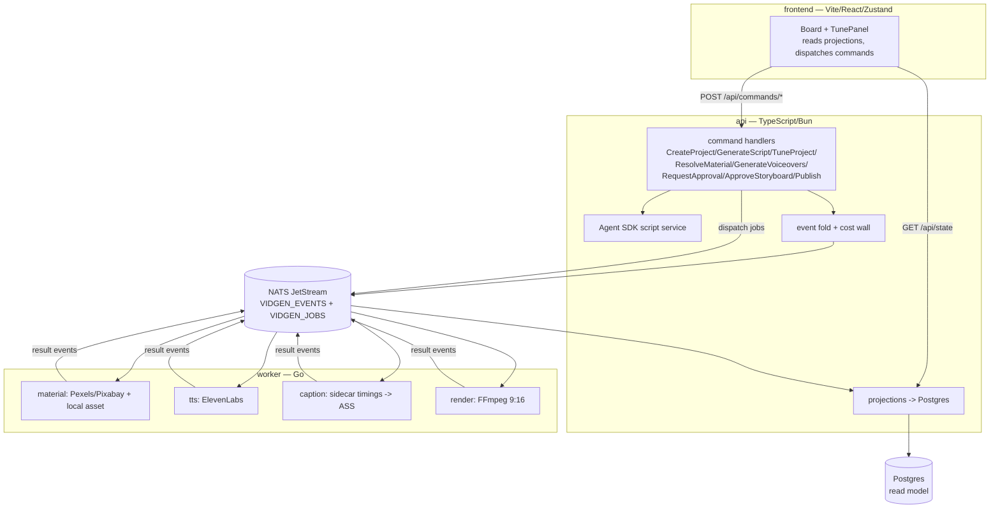

# vidgen

[](https://github.com/cuongtranba/video-generation-skill/actions/workflows/test.yml)
[](https://github.com/cuongtranba/video-generation-skill/releases)
[](./LICENSE)
[](https://bun.sh)
[](https://go.dev)
[](https://react.dev)
[](https://nats.io)
[](https://www.postgresql.org)

Event-sourced webapp that turns an idea into a ready-to-post short-form vertical video (9:16, 15–90s) with **Vietnamese voiceover**, karaoke captions, stock footage, local uploads, and background music — end to end, in the browser.

```
"3 lý do bạn nên uống nước ấm mỗi sáng"
        │
        ▼
   21s MP4 · 1080x1920 · giọng ElevenLabs · phụ đề karaoke · nhạc nền
   cost: $0.0036 (cap $0.15)
```

## Architecture

Three services over NATS JetStream + Postgres. The **api** owns the event store, command handlers, and read-model projections; the **worker** runs the media pipeline as idempotent job consumers; the **frontend** is a live event board. Frozen architecture facts live in `.c3/` (see the [C3 skill](#project-layout)).



**Event-sourced flow.** Commands append to `VIDGEN_EVENTS` and dispatch jobs to `VIDGEN_JOBS`. Workers consume jobs and emit result events (`MaterialResolved`, `VoiceSynthesized`, `CaptionsBuilt`, `RenderCompleted`, `RunFailed`). The api folds events into `ProjectState` and projects them into Postgres for the read model (`GET /api/state`). `dispatchJob` does no key remapping — api payload keys equal the worker's JSON tags. Most jobs are dispatched by a command; the exception is the caption job, dispatched by a live event reaction (`api/src/reactions.ts`) once every scene's `VoiceSynthesized` has landed, so the per-scene word-timestamp sidecars are guaranteed on disk before the caption handler reads them.

**Cost wall.** `Σ VoiceSynthesized.ttsUsd ≤ COST_CAP_USD` (default `$0.15`, set in compose). Projected at `GenerateVoiceovers` (`CostProjected`) and enforced before spend.

### Components

Three containers, 27 components (ids from the C3 model in `.c3/`).

**`api` — TypeScript/Bun event-sourced command surface**

| Component | Responsibility |
|---|---|
| `events` | Frozen `VidgenEvent` union + `foldProject` → `ProjectState` |
| `aggregate` | Command-transition guards (project exists, legal transition) |
| `commands` | Command handlers + dispatcher |
| `nats` | `EventStore` (VIDGEN_EVENTS), job publisher (VIDGEN_JOBS), projection consumer wiring |
| `projections` | Postgres read model, durable consumer |
| `cost` | TTS budget estimator + enforced cost wall |
| `script` | Agent SDK scene generator (idea → scenes) |
| `http` | HTTP command surface + static SPA/media server |
| `db` | Thin typed Postgres connection wrapper |

**`worker` — Go idempotent job consumers**

| Component | Responsibility |
|---|---|
| `jobhandler` | material / tts / caption / render handler types |
| `eventstore` | Worker-side result event structs + publisher |
| `tts` | ElevenLabs TTS provider behind a factory |
| `material` | Stock visual sourcing (Pexels / Pixabay) + download |
| `music` | Jamendo background-music search + download |
| `render` | FFmpeg filtergraph 9:16 MP4 composer |
| `caption` | ElevenLabs word-timestamp sidecars (`tts{idx}.words.json`) → ASS karaoke captions |
| `config` | Provider selection + secret loading from `config.yaml`/`.env` |
| `prereq` | External binary resolver (ffmpeg, ffprobe) |
| `domain` | Shared domain value types (Voice, Speed, CaptionStyle) |

**`frontend` — Vite/React/Zustand live event board**

| Component | Responsibility |
|---|---|
| `store` | Zustand store + `VidgenEvent` mirror of the api catalogue |
| `natsClient` | NATS WebSocket subscription to VIDGEN_EVENTS |
| `Board` | Live project list view |
| `ProjectCard` | Per-project status card |
| `TunePanel` | Style tuning + storyboard approval panel |
| `SceneStrip` | Per-scene asset (thumbnail/audio) preview |
| `StoryboardApproval` | Approval-gate widget |

## Quick start

```bash
# secrets (gitignored) — only the keys for your selected providers are required
cat > .env <<'EOF'
ELEVENLABS_API_KEY=...   # elevenlabs.io — multilingual Vietnamese TTS (required)
PEXELS_API_KEY=...       # pexels.com/api — stock video
PIXABAY_API_KEY=...      # pixabay.com/api — stock video (optional)
JAMENDO_CLIENT_ID=...    # devportal.jamendo.com — music search
EOF

# Agent SDK auth for script generation (no API key needed — the SDK bundles its
# runtime; a Claude subscription OAuth token works). One of:
export CLAUDE_CODE_OAUTH_TOKEN=...   # from `claude setup-token`
#   or  export ANTHROPIC_API_KEY=...

docker compose up --build
```

Drive the pipeline from the browser SPA, or hit the HTTP command API directly:

```bash
API=http://localhost:8080
PID=$(curl -s -X POST $API/api/commands/CreateProject -H 'content-type: application/json' \
  -d '{"idea":"a calico cat learns to surf","durationSec":16,"sceneCount":2,"tone":"playful","idempotencyKey":"1"}' \
  | sed -E 's/.*"projectId":"([^"]+)".*/\1/')

curl -s -X POST $API/api/commands/GenerateScript     -d "{\"projectId\":\"$PID\",\"idempotencyKey\":\"2\"}" -H 'content-type: application/json'
curl -s -X POST $API/api/commands/TuneProject        -d "{\"projectId\":\"$PID\",\"captionStyle\":{\"fontName\":\"Arial\",\"fontSize\":48},\"idempotencyKey\":\"3\"}" -H 'content-type: application/json'
curl -s -X POST $API/api/projects/$PID/assets        -F file=@./my-clip.jpg      # optional local upload (used as scene media, in order)
curl -s -X POST $API/api/commands/ResolveMaterial    -d "{\"projectId\":\"$PID\",\"idempotencyKey\":\"4\"}" -H 'content-type: application/json'
curl -s -X POST $API/api/commands/GenerateVoiceovers -d "{\"projectId\":\"$PID\",\"idempotencyKey\":\"5\"}" -H 'content-type: application/json'
# wait for voiceovers + captions to finish (GET /api/state shows scene mp3/ass), then:
curl -s -X POST $API/api/commands/RequestApproval    -d "{\"projectId\":\"$PID\",\"idempotencyKey\":\"6\"}" -H 'content-type: application/json'
curl -s -X POST $API/api/commands/ApproveStoryboard  -d "{\"projectId\":\"$PID\",\"idempotencyKey\":\"7\"}" -H 'content-type: application/json'
# render output.mp4 lands on the shared media volume; status -> rendered
```

> **Approval is gated:** `ApproveStoryboard` returns `400` until every scene has its voiceover + resolved material and captions are built. Captions come from the ElevenLabs synthesis word timings (no transcription step), so they're ready seconds after the last voiceover.

## Command API

All commands are `POST /api/commands/<Name>` with a JSON body carrying `projectId` (except `CreateProject`) and an `idempotencyKey` (replays return the cached result).

| Command | Body (beyond `idempotencyKey`) | Effect |
|---|---|---|
| `CreateProject` | `idea`, `durationSec`, `sceneCount`, `tone` | Emit `ProjectCreated`; returns `projectId` |
| `GenerateScript` | `projectId` | Agent SDK writes scenes → `ScriptGenerated` |
| `TuneProject` | `projectId`, `captionStyle?`, `music?` | Last-write-wins `StyleSet` (see [Tune](#tune)) |
| `ResolveMaterial` | `projectId` | Dispatch material jobs (local uploads first, else stock) → `MaterialResolved` |
| `GenerateVoiceovers` | `projectId` | Project cost (`CostProjected`), enforce cap, dispatch TTS → `VoiceSynthesized` |
| `RequestApproval` | `projectId` | `AwaitingApproval` once inputs are pending |
| `ApproveStoryboard` | `projectId` | `400` until inputs ready; else `ApprovalGranted` → render → `RenderCompleted` |
| `Publish` | `projectId` | `Published` (publish provider is `none` by default) |

Other routes:

| Route | Purpose |
|---|---|
| `GET /api/state` | Full read model (all projects + scenes) |
| `GET /api/config` | `{ ttsProvider }` — the SPA uses it to render the fixed-voice label |
| `POST /api/projects/:id/assets` | Multipart upload (`.mp4/.mov/.jpg/.jpeg/.png`), assigned to scenes in upload order |
| `GET /api/projects/:id/assets` | List uploaded assets |
| `GET /api/projects/:id` | Single project read model |
| `GET /media/*` | Rendered output + intermediate media from the shared volume |
| `POST /api/login` | Sign in (`{ username, password }`); sets an HttpOnly signed `vg_session` cookie |
| `POST /api/logout` | Clear the session cookie |
| `GET /api/session` | `{ authenticated }` — the SPA probes this on bootstrap |

**Auth.** Every `/api/*` route except `login`/`logout`/`session` requires a valid `vg_session` cookie (401 otherwise); the SPA and `/media` stay public so the login screen loads. Set the credentials as environment variables — `AUTH_USERNAME` (default `admin`) and `AUTH_PASSWORD` — in your gitignored `.env` locally and as Dokploy env vars in production; **the password is never committed**. If `AUTH_PASSWORD` is unset the api generates a random per-boot password (logged) so an unconfigured deploy fails closed. Sessions are stateless HMAC-signed cookies keyed by `SESSION_SECRET` (set a stable value in production, else a restart invalidates sessions). The SPA is Vietnamese by default with an in-header EN/VI switcher (react-i18next; choice persisted to `localStorage`).

## Event catalogue

The `VidgenEvent` union is frozen in `api/src/events.ts`, mirrored verbatim in `frontend/src/store/events.ts`, and matched by the worker structs in `worker/internal/eventstore/events.go`.

| Event | Emitted by | Meaning |
|---|---|---|
| `ProjectCreated` | `CreateProject` | New project + idea/duration/scene params |
| `ScriptGenerated` | `GenerateScript` | Scenes (narration + visual prompts); `scriptUsd` |
| `StyleSet` | `TuneProject` | Caption style / music (last-write-wins) |
| `MaterialResolved` | worker material | Scene `assetPath` (stock or upload), `isImage` |
| `VoiceSynthesized` | worker tts | Scene mp3 + `durationSec` + `ttsUsd` |
| `CaptionsBuilt` | worker caption | ASS captions ready from ElevenLabs word timings (`captionsReady`) |
| `CostProjected` | `GenerateVoiceovers` | Projected TTS spend vs. `COST_CAP_USD` |
| `AwaitingApproval` | `RequestApproval` | Storyboard is pending human approval |
| `ApprovalGranted` | `ApproveStoryboard` | Inputs complete; render dispatched |
| `RenderCompleted` | worker render | `output.mp4` on the media volume |
| `Published` | `Publish` | Publish step recorded |
| `RunFailed` | any worker | A job failed (carries the failing step/error) |

## Tune

`TuneProject` records a `StyleSet` event (last-write-wins) folded into `ProjectState.style`, allowed any time before approval:

| Field | Meaning |
|---|---|
| `voice` | *(not adjustable)* — ElevenLabs uses a fixed multilingual voice ID; the SPA shows a read-only "ElevenLabs (fixed)" label instead of a picker |
| `speed` | *(not adjustable)* — ElevenLabs has no speed control in this integration |
| `captionStyle` | `{ fontName, fontSize }` |
| `music` | `{ search, volume }` (Jamendo mood search) or `null` |

Local uploads (`POST /api/projects/:id/assets`, `.mp4/.mov/.jpg/.jpeg/.png`) are assigned to scenes in upload order; scenes without an upload fall back to stock.

## Providers

Selected per-category in `config.yaml` (mounted into the worker **and** the api via `CONFIG_PATH`). Keys stay in `.env`; only selected providers' keys are required and are validated by `config.ValidateForProviders`. The api reads `tts.provider` from `config.yaml` and exposes it at `GET /api/config` → `{ ttsProvider }`.

```yaml
tts:
  provider: elevenlabs   # only supported TTS provider
material:
  providers: [pexels]    # pexels | pixabay
music:
  provider: jamendo      # jamendo | none
videogen: { provider: none }
publish:  { provider: none }
```

| Category | Providers |
|---|---|
| `tts` | ElevenLabs (`eleven_turbo_v2_5` for Vietnamese, fixed voice ID; override with `ELEVENLABS_VOICE_ID` / `ELEVENLABS_MODEL_ID`) |
| `material` | Pexels, Pixabay, local uploads |
| `music` | Jamendo |

## Project layout

```
.
├── api/            TypeScript/Bun — event store, commands, projections, cost wall, HTTP (bun test)
├── worker/         Go — idempotent job handlers: material, tts, caption, render (go test ./...)
├── frontend/       Vite/React/Zustand — live event board SPA (bun test)
├── rules/          ast-grep rules + rule-tests (bun run test:sg / lint:sg)
├── .c3/            frozen C3 architecture facts (managed by the C3 skill — do not hand-edit)
├── .github/workflows/  test.yml (CI) + release-please.yml
├── config.yaml     provider selection (mounted into api + worker)
└── docker-compose.yml
```

## Development

```bash
# api (TypeScript/Bun)
cd api && bun test          # unit tests (never *.integration.test.ts — needs live NATS+Postgres)
cd api && bun run typecheck

# worker (Go)
cd worker && go build ./...
cd worker && go test ./internal/jobhandler/... ./internal/render/...   # targeted
cd worker && go vet ./...

# frontend (Vite/React)
cd frontend && bun test
cd frontend && bun run lint        # oxlint
cd frontend && bun run typecheck

# ast-grep gates (repo root)
bun install                 # once — installs @ast-grep/cli
bun run test:sg             # rule self-tests
bun run lint:sg             # scan: useState ban (frontend), interface{}/any ban (worker)
```

CI (`.github/workflows/test.yml`) runs four jobs on push/PR to `main`: **ast-grep** (rule tests + scan), **api** (typecheck + `bun test`, integration suites self-skip without NATS/Postgres), **worker** (`go build`/`vet`/`test ./...`), **frontend** (oxlint, typecheck, `bun test`, vite build). External binaries in the worker image: ffmpeg (with libass).

## Release process

Versioning is automated by [release-please](https://github.com/googleapis/release-please) (single root release: one version, one `vX.Y.Z` tag, one `CHANGELOG.md`).

1. Land changes on `main` with [Conventional Commit](https://www.conventionalcommits.org) messages (`feat:`, `fix:`, `docs:`, `ci:`, `chore:`).
2. `.github/workflows/release-please.yml` opens or updates a **Release PR** that bumps the version and rolls the changelog.
3. Merge the Release PR → release-please tags `vX.Y.Z` and publishes a GitHub Release. The release badge updates automatically.

`feat:` → minor, `fix:` → patch, `feat!:`/`BREAKING CHANGE:` → major.

## License

[MIT](./LICENSE) © 2026 cuong.tran

## Attribution

- Stock footage: [Pexels](https://pexels.com) / [Pixabay](https://pixabay.com)
- Music: [Jamendo](https://jamendo.com)
