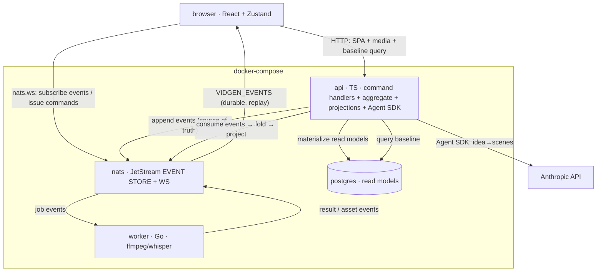

# vidgen

Web app that turns an idea into a ready-to-post short-form vertical video (9:16, 15–90s) with **Vietnamese voiceover**, karaoke captions, stock footage, and background music — end to end, from your browser.

```
"3 lý do bạn nên uống nước ấm mỗi sáng"
        │
        ▼
   21s MP4 · 1080x1920 · giọng banmai · phụ đề karaoke · nhạc nền
   cost: $0.0036
```

> **New to vidgen?** Start with the [Getting Started guide](docs/GETTING_STARTED.md) — from install to your first rendered video, step by step.

## Demo

[docs/demo.mp4](docs/demo.mp4) — generated from the idea above: 3 scenes, Pexels footage, FPT.AI `banmai` voice, word-timed captions, Jamendo background music.

## Features

- **7-step browser flow** — New Project → script → material → voiceovers → approve → render → download/publish, resumable at any step (event-sourced per project)
- **Vietnamese TTS** — FPT.AI voices, northern/southern/central accents
- **Script generation** — scene-by-scene script from one idea, via Anthropic Agent SDK
- **Material resolution** — Pexels/Pixabay stock footage per scene; short clips loop to cover narration
- **Karaoke captions** — Whisper word-level timestamps → ASS subtitles burned into the video
- **Background music** — Jamendo search by mood; looped, ducked under the voice, faded out
- **Cost wall** — hard `COST_CAP_USD` (default `$0.15`) cap enforced before generation (projection) and during (actual spend via `cost_ledger`); breach halts the pipeline
- **Event-sourced pipeline** — NATS JetStream (`VIDGEN_EVENTS`) is the source of truth; idempotent jobs (crash → rerun skips finished work); Postgres is a disposable read-model projection

## Installation

**Requirements:** Docker (all other dependencies are in containers — no Go, brew, or whisper install needed on the host).

```bash
git clone https://github.com/cuongtranba/video-generation-skill
cd video-generation-skill
cp .env.example .env   # fill in your API keys
docker compose up --build
```

Then open [http://localhost:3000](http://localhost:3000).

## Configuration

Create `.env` in the repo root:

```env
FPT_TTS_API_KEY=...      # console.fpt.ai — Vietnamese TTS
PEXELS_API_KEY=...       # pexels.com/api — stock video (free)
PIXABAY_API_KEY=...      # optional — image fallback
JAMENDO_CLIENT_ID=...    # devportal.jamendo.com — music search (free)
TIKTOK_ACCESS_TOKEN=...  # developers.tiktok.com — required only for publish
COST_CAP_USD=0.15        # hard cost ceiling per video (default 0.15)
```

## Usage

The browser flow is **7 steps**:

1. **New Project** — enter your idea, choose duration and number of scenes
2. **Script** — Agent SDK generates a scene-by-scene Vietnamese script (Anthropic API, `scriptUsd = $0`)
3. **Material** — fetch Pexels/Pixabay stock clips for each scene
4. **Voiceovers** — FPT.AI TTS per scene (async, polls until ready); cost projected against `COST_CAP_USD`
5. **Approve** — review projected cost in the approval-gate UI before committing to render
6. **Render** — parallel TTS → Whisper captions → FFmpeg filter-graph; idempotent (crash → rerun at $0)
7. **Download / Publish** — download the final MP4 or push to TikTok

### Voices (FPT.AI)

| Voice | Gender | Accent |
|---|---|---|
| `banmai` | female | northern |
| `thuminh` | female | northern |
| `lannhi` | female | southern |
| `linhsan` | female | southern |
| `leminh` | male | northern |
| `giahuy` | male | central |
| `myan` | female | central |

### v1 limitations

- No local-asset upload (`--resource` descoped for v1)
- No tune step (voice, speed, caption style, music — all fixed defaults in v1)
- No re-publish (`--force` descoped for v1)

## Architecture



### Services

| Service | Lang | Role |
|---|---|---|
| `nats` | — | JetStream event store (`VIDGEN_EVENTS`, `VIDGEN_JOBS`) + WebSocket listener |
| `postgres` | — | read-model projections, rebuildable from the event log |
| `api` | TypeScript/Node | command handlers, Project aggregate, Agent SDK script gen, cost-wall admissibility, projections, serves SPA + media |
| `worker` | Go | consumes job events, runs ffmpeg+libass/whisper (tts/material/caption/render), emits result/asset events |
| `frontend` | Vite/React/TS/Zustand | SPA; served by `api` in prod |

### Design notes

- **Event sourcing** — `VIDGEN_EVENTS` (NATS JetStream) is the append-only source of truth; Postgres read models are projections that can be fully rebuilt by replaying the event log
- **Idempotency** — worker checks its output file before working; re-running generate after a crash re-uses finished TTS/captions ($0); event appends deduplicated by `Nats-Msg-Id` (2-minute dedup window per NATS index)
- **Cost wall** — `COST_CAP_USD` enforced in `api` aggregate at `GenerateVoiceovers` (projected) and tracked via `cost_ledger` events (actual). `ScriptGenerated.scriptUsd = 0` always. Never remove or weaken.

## Cost

| Item | Per 30s video |
|---|---|
| Script (Agent SDK) | $0 (scriptUsd=0) |
| FPT.AI TTS ~400 chars | ~$0.004 |
| Pexels / Jamendo | $0 (free tiers) |
| Whisper + FFmpeg (in worker container) | $0 |
| **Total** | **< $0.01** |

## Development

```bash
cd worker && go test ./...                                    # Go worker unit tests
cd worker && go test -tags=integration ./internal/render/...  # real FFmpeg render test
cd worker && go vet ./...
cd api && bun test
cd frontend && bun test && bun run lint
docker compose up --build                                     # full stack
```

## Attribution

- Stock footage: [Pexels](https://pexels.com) / [Pixabay](https://pixabay.com) (free commercial licenses)
- Music: [Jamendo](https://jamendo.com) — track attribution recorded in each project's event log
- Demo track: The.madpix.project — *Wish You Were Here*
