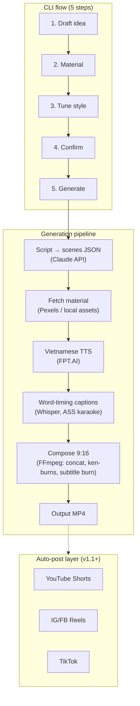

# vidgen

CLI tool that generates short-form vertical videos (TikTok/Reels/Shorts style, 9:16) with Vietnamese voiceover, from an idea to a rendered MP4.

## Goal (OKR frame)

- **Objective:** 10 videos/week, end-to-end (idea → rendered VN-voiced 9:16 MP4) via CLI.
- **Anti-goal (tripwire):** cost per video ≤ $0.10, measured per render. Breach halts generation.
- **v1 scope:** local MP4 output only. Auto-posting (YouTube Shorts first) deferred to v1.1.

## User flow (5 steps)

1. **Draft** — interactive prompt turns the user's idea into a scene-by-scene script
2. **Material** — fetch stock footage (Pexels/Pixabay) or use user-provided assets
3. **Tune** — voice (N/S accent), tone, duration, caption style
4. **Confirm** — preview manifest + projected cost
5. **Generate** — render final MP4

## Architecture



## Stack

| Concern | Tool | Notes |
|---|---|---|
| CLI | Go | single binary |
| Script generation | Claude API | structured scenes JSON |
| Vietnamese TTS | FPT.AI | North + South accents; F5-TTS (self-hosted) planned for scale |
| Stock material | Pexels API (Pixabay fallback) | free, commercial license |
| Caption timing | Whisper (local, `vi`) | word-level timestamps → ASS karaoke |
| Background music | Jamendo API or local file | looped, ducked under voice, 2s fade-out |
| Composition | FFmpeg (direct) | 9:16, subtitle burn-in, hw-accelerated encode |

## Roadmap

- **v1** — CLI, local MP4 output
- **v1.1** — YouTube Shorts auto-post (direct API); file Meta app review in parallel
- **v2** — webapp, IG/FB Reels, TikTok (via audit or aggregator), optional AI b-roll

## Setup

`.env` keys:

```
FPT_TTS_API_KEY=...      # console.fpt.ai
PEXELS_API_KEY=...       # pexels.com/api
JAMENDO_CLIENT_ID=...    # devportal.jamendo.com (for --music-search)
```

Binaries: `ffmpeg`/`ffprobe` with libass (`brew install homebrew-ffmpeg/ffmpeg/ffmpeg`), `whisper` (`brew install openai-whisper`), `claude` CLI.

## Usage

```bash
vidgen new "3 lý do bạn nên uống nước ấm mỗi sáng" --duration 45 --resource ./demo
vidgen material --project <ID>
vidgen tune --project <ID> --voice banmai --music-search "upbeat acoustic" --music-volume 0.35
vidgen confirm --project <ID>
vidgen generate --project <ID> --output out.mp4
```

## Development

```bash
go build ./cmd/vidgen
go test ./...
```
