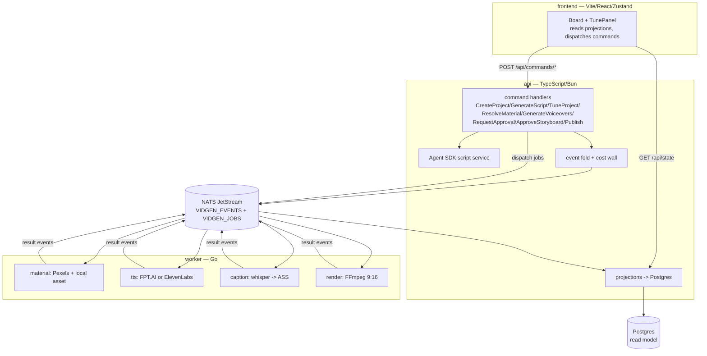

# vidgen

Event-sourced webapp that turns an idea into a ready-to-post short-form vertical video (9:16, 15–90s) with **Vietnamese voiceover**, karaoke captions, stock footage, local uploads, and background music — end to end, in the browser.

```
"3 lý do bạn nên uống nước ấm mỗi sáng"
        │
        ▼
   21s MP4 · 1080x1920 · giọng lannhi · phụ đề karaoke · nhạc nền
   cost: $0.0036 (cap $0.15)
```

## Architecture

Three services over NATS JetStream + Postgres. The api owns the event store, command handlers, and read-model projections; the worker runs the media pipeline as idempotent job consumers; the frontend is a live event board.



**Event-sourced flow.** Commands append to `VIDGEN_EVENTS` and dispatch jobs to `VIDGEN_JOBS`. Workers consume jobs, emit result events (`MaterialResolved`, `VoiceSynthesized`, `CaptionsBuilt`, `RenderCompleted`, `RunFailed`). The api folds events into `ProjectState` and projects them into Postgres for the read model (`GET /api/state`).

**Cost wall.** `Σ VoiceSynthesized.ttsUsd ≤ COST_CAP_USD` (default `$0.15`, set in compose). Projected at `GenerateVoiceovers` (`CostProjected`), enforced before spend.

## Quick start

```bash
# secrets (gitignored) — only the keys for your selected providers are required
cat > .env <<'EOF'
FPT_TTS_API_KEY=...      # console.fpt.ai — Vietnamese TTS (free tier is rate-limited)
ELEVENLABS_API_KEY=...   # elevenlabs.io — multilingual TTS (set tts.provider: elevenlabs)
PEXELS_API_KEY=...       # pexels.com/api — stock video
JAMENDO_CLIENT_ID=...    # devportal.jamendo.com — music search
EOF

# Agent SDK auth for script generation (no API key needed — the SDK bundles its
# runtime; a Claude subscription OAuth token works). One of:
export CLAUDE_CODE_OAUTH_TOKEN=...   # from `claude setup-token`
#   or  export ANTHROPIC_API_KEY=...

docker compose up --build
```

Then drive the pipeline (browser SPA, or the HTTP command API directly):

```bash
API=http://localhost:8080
PID=$(curl -s -X POST $API/api/commands/CreateProject -H 'content-type: application/json' \
  -d '{"idea":"a calico cat learns to surf","durationSec":16,"sceneCount":2,"tone":"playful","idempotencyKey":"1"}' \
  | sed -E 's/.*"projectId":"([^"]+)".*/\1/')

curl -s -X POST $API/api/commands/GenerateScript   -d "{\"projectId\":\"$PID\",\"idempotencyKey\":\"2\"}" -H 'content-type: application/json'
curl -s -X POST $API/api/commands/TuneProject      -d "{\"projectId\":\"$PID\",\"voice\":\"lannhi\",\"speed\":1,\"idempotencyKey\":\"3\"}" -H 'content-type: application/json'
curl -s -X POST $API/api/projects/$PID/assets      -F file=@./my-clip.jpg      # optional local upload (used as scene media, in order)
curl -s -X POST $API/api/commands/ResolveMaterial  -d "{\"projectId\":\"$PID\",\"idempotencyKey\":\"4\"}" -H 'content-type: application/json'
curl -s -X POST $API/api/commands/GenerateVoiceovers -d "{\"projectId\":\"$PID\",\"idempotencyKey\":\"5\"}" -H 'content-type: application/json'
# wait for voiceovers + whisper captions to finish (GET /api/state shows scene mp3/ass), then:
curl -s -X POST $API/api/commands/RequestApproval  -d "{\"projectId\":\"$PID\",\"idempotencyKey\":\"6\"}" -H 'content-type: application/json'
curl -s -X POST $API/api/commands/ApproveStoryboard -d "{\"projectId\":\"$PID\",\"idempotencyKey\":\"7\"}" -H 'content-type: application/json'
# render output.mp4 lands on the shared media volume; status -> rendered
```

> **Approval is gated:** `ApproveStoryboard` returns `400` until every scene has its voiceover + resolved material and captions are built. Approve only once processing finishes (whisper transcription takes a couple of minutes).

## Tune

`TuneProject` records a `StyleSet` event (last-write-wins) folded into `ProjectState.style`, allowed any time before approval:

| Field | Meaning |
|---|---|
| `voice` | FPT voice: `banmai`/`thuminh`/`lannhi`/`linhsan`/`leminh`/`giahuy`/`myan` (ElevenLabs uses a fixed voice ID — under `tts.provider: elevenlabs` the SPA disables this control, since the worker ignores it) |
| `speed` | speech rate, integer −3..3 (also ignored, and disabled in the SPA, under ElevenLabs) |
| `captionStyle` | `{ fontName, fontSize }` |
| `music` | `{ search, volume }` (Jamendo mood search) or `null` |

Local uploads (`POST /api/projects/:id/assets`, `.mp4/.mov/.jpg/.jpeg/.png`) are assigned to scenes in upload order; scenes without an upload fall back to Pexels stock.

## Providers

Selected per-category in `config.yaml` (mounted into the worker **and** the api). Keys stay in `.env`; only selected providers' keys are required. The api reads `tts.provider` from `config.yaml` and exposes it at `GET /api/config` → `{ ttsProvider }`, which the SPA uses to gate the voice/speed tune controls.

```yaml
tts:
  provider: elevenlabs   # fpt | elevenlabs
material:
  providers: [pexels]    # pexels | pixabay
music:
  provider: jamendo      # jamendo | none
videogen: { provider: none }
publish:  { provider: none }
```

| Category | Providers |
|---|---|
| `tts` | FPT.AI (async poll), ElevenLabs (multilingual_v2) |
| `material` | Pexels, Pixabay, local uploads |
| `music` | Jamendo |

## Development

```bash
# api (TypeScript/Bun)
cd api && bun test          # unit tests (integration tests need live NATS+Postgres)
cd api && bun run typecheck

# worker (Go)
cd worker && go build ./...
cd worker && go test ./internal/jobhandler/... ./internal/render/...   # targeted
cd worker && go vet ./...

# frontend (Vite/React)
cd frontend && bun test
```

Architecture facts live in `.c3/` (see the C3 skill). External binaries in the worker image: ffmpeg (with libass), whisper.

## Attribution

- Stock footage: [Pexels](https://pexels.com) / [Pixabay](https://pixabay.com)
- Music: [Jamendo](https://jamendo.com)
