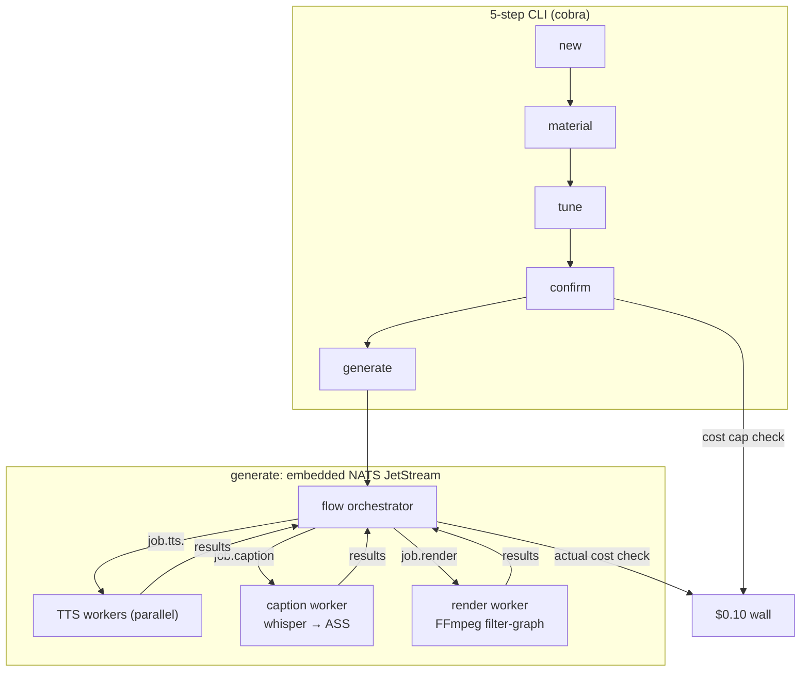

# vidgen

CLI tool that turns an idea into a ready-to-post short-form vertical video (9:16, 15–90s) with **Vietnamese voiceover**, karaoke captions, stock footage, and background music — end to end, from your terminal.

```
"3 lý do bạn nên uống nước ấm mỗi sáng"
        │
        ▼
   21s MP4 · 1080x1920 · giọng banmai · phụ đề karaoke · nhạc nền
   cost: $0.0036
```

## Demo

▶️ [docs/demo.mp4](docs/demo.mp4) — generated from the idea above: 3 scenes, Pexels footage, FPT.AI `banmai` voice, word-timed captions, Jamendo background music.

## Features

- **5-step guided flow** — draft → material → tune → confirm → generate, resumable at any step (manifest persisted per project)
- **Vietnamese TTS** — FPT.AI voices, northern/southern/central accents, speed control
- **Script generation** — scene-by-scene script from one idea, via the `claude` CLI (subscription auth, no API key)
- **Material resolution** — your own photos/videos first (`--resource`), Pexels/Pixabay stock fills the gaps; short clips loop to cover narration
- **Karaoke captions** — Whisper word-level timestamps → ASS subtitles burned into the video
- **Background music** — search Jamendo by mood (`--music-search "upbeat acoustic"`) or bring your own file; looped, ducked under the voice, faded out
- **Cost wall** — hard $0.10/video cap enforced *before* generation (projection) and *during* (actual spend); breach halts the pipeline
- **Event-driven pipeline** — embedded NATS JetStream; parallel per-scene TTS workers; idempotent jobs (crash → rerun skips finished work)

## Installation

```bash
# binaries
brew install homebrew-ffmpeg/ffmpeg/ffmpeg   # ffmpeg WITH libass (core formula lacks subtitle filters)
brew install openai-whisper                  # caption timing
# claude CLI: https://claude.ai/code — must be logged in

# build
git clone https://github.com/cuongtranba/video-generation-skill
cd video-generation-skill
go build -o vidgen ./cmd/vidgen
```

## Configuration

Create `.env` in the working directory:

```env
FPT_TTS_API_KEY=...      # console.fpt.ai — Vietnamese TTS
PEXELS_API_KEY=...       # pexels.com/api — stock video (free)
PIXABAY_API_KEY=...      # optional — image fallback
JAMENDO_CLIENT_ID=...    # devportal.jamendo.com — music search (free)
```

Binary overrides (optional): `FFMPEG_BIN`, `FFPROBE_BIN`, `WHISPER_BIN`, `CLAUDE_BIN`.

## Usage

```bash
# 1. Draft — idea → scene script (Vietnamese narration + visual notes)
./vidgen new "3 lý do bạn nên uống nước ấm mỗi sáng" --duration 30 --scenes 3 --tone casual
# → Project 7ccd643c created (3 scenes)

# with your own media (scenes are written AROUND your assets):
./vidgen new "review quán cà phê" --duration 45 --resource ./my-photos

# 2. Material — fetch stock clips for every scene
./vidgen material --project 7ccd643c

# 3. Tune — voice, speed, captions, music
./vidgen tune --project 7ccd643c \
  --voice banmai --speed 0 \
  --music-search "calm inspiring acoustic" --music-volume 0.3

# 4. Confirm — review projected cost against the $0.10 cap
./vidgen confirm --project 7ccd643c
# → Projected cost: $0.0036 (cap $0.10) — OK

# 5. Generate — parallel TTS, captions, final render
./vidgen generate --project 7ccd643c --output video.mp4

# list all projects + status
./vidgen list
```

### Voices (FPT.AI)

| Voice | Gender | Accent |
|---|---|---|
| `banmai` | female | northern |
| `thuminh` | female | northern |
| `lannhi` | female | southern |
| `linhsan` | female | southern |
| `leminh` | male | northern |
| `giahuy` | male | central |
| `myan` | female | central |

### Tune flags

| Flag | Meaning |
|---|---|
| `--voice` | FPT voice (table above) |
| `--speed` | speech rate −3..+3 |
| `--caption-font`, `--caption-size` | ASS caption style |
| `--music <file>` | local music file, looped + ducked |
| `--music-search "<tags>"` | Jamendo mood/genre search, top track auto-downloaded |
| `--music-volume` | 0–1, default 0.15 (0.3–0.4 recommended) |

## Architecture



| Package | Responsibility |
|---|---|
| `internal/domain` | project manifest, scenes, style, cost ledger (JSON at `~/.vidgen/projects/<id>/`) |
| `internal/script` | claude CLI subprocess → scene JSON |
| `internal/material` | Pexels / Pixabay / local assets, priority chain |
| `internal/tts` | FPT.AI async API (submit → poll mp3 → download) |
| `internal/caption` | Whisper word timestamps → ASS karaoke (gap-aware line splits) |
| `internal/music` | Jamendo search + download |
| `internal/render` | FFmpeg filter-graph: 9:16 crop, ken-burns stills, clip looping, subtitle burn, music mix |
| `internal/bus` | embedded NATS server + JetStream job/result streams |
| `internal/worker` | idempotent TTS / material / caption / render workers |
| `internal/cost` | ledger + $0.10 admissibility checks |
| `internal/flow` | step orchestration + status machine |
| `internal/cli` | cobra commands, prereq checks |

### Design notes

- **Idempotency** — every worker checks its output file before working; re-running `generate` after a crash re-uses finished TTS/captions ($0)
- **Cost wall** — three checkpoints: projected at confirm, actual after each API call, paired at completion
- **NATS in-process** — no external infra for the CLI; the same workers can attach to an external NATS cluster for the future webapp

## Cost

| Item | Per 30s video |
|---|---|
| Script (claude CLI) | $0 (subscription) |
| FPT.AI TTS ~400 chars | ~$0.004 |
| Pexels / Jamendo | $0 (free tiers) |
| Whisper + FFmpeg (local) | $0 |
| **Total** | **< $0.01** |

## Development

```bash
go test ./...                                        # unit tests (93)
go test -tags=integration ./internal/render/...      # real FFmpeg render test
go vet ./...
```

## Roadmap

- **v1.1** — YouTube Shorts auto-post (direct API), Meta app review for IG/FB Reels
- **v2** — webapp, TikTok (audit or aggregator), optional AI b-roll, F5-TTS self-hosted voice cloning

## Attribution

- Stock footage: [Pexels](https://pexels.com) / [Pixabay](https://pixabay.com) (free commercial licenses)
- Music: [Jamendo](https://jamendo.com) — track attribution recorded in each project manifest (`music_track`)
- Demo track: The.madpix.project — *Wish You Were Here*
