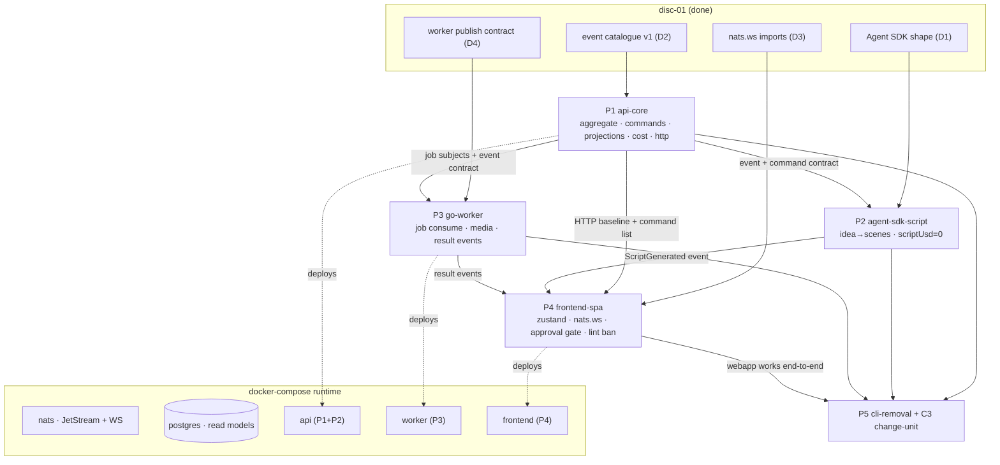

# vidgen Webapp Rewrite — Implementation Plan Index & Frozen Contracts

> **This is the single source of truth for names, types, and interfaces shared across the 5 subsystem plans.** Each plan references this file; do NOT redefine or rename these contracts inside a plan. If a plan needs a change to a frozen contract, that is a spec change — stop and escalate.

**Spec:** `docs/superpowers/specs/2026-07-09-vidgen-webapp-event-store-design.md`
**Discovery evidence:** `.okra/runs/disc-01/checkpoints/` (D1–D4 + SYNTHESIS). Decision: **GO**.

---

## 1. Subsystem plans (build order)

| # | Plan file | Produces |
|---|---|---|
| P1 | `…-01-api-core.md` | TS `api`: NATS wiring, Postgres schema, Project aggregate, command handlers, projections, cost ledger, HTTP. **Foundation — all others depend on the event/command contracts it makes concrete.** |
| P2 | `…-02-agent-sdk-script.md` | Agent SDK script service inside `api` (idea → scenes, `scriptUsd = 0`). |
| P3 | `…-03-go-worker.md` | Go `worker`: consume job events, run tts/material/caption/render, publish result events with msgID idempotency. |
| P4 | `…-04-frontend-spa.md` | Vite/React/TS/Zustand SPA: nats.ws store, command dispatch, live board, approval gate UI, ESLint local-state ban + fixture test. |
| P5 | `…-05-cli-removal-c3.md` | Delete `cmd/vidgen` + `internal/cli`; C3 change-unit re-onboarding the webapp topology. **Last.** |

## 2. Dependency graph



## 3. Target repo layout

```
api/                       # TypeScript Node service (P1, P2)
  src/
    events.ts              # VidgenEvent union — PROMOTED verbatim from spikes/event-model/events.ts
    aggregate.ts           # foldProject (from D2) + invariant guards
    nats.ts                # connect, ensureStreams, publishEvent, dispatchJob, consumeEvents
    db.ts                  # pg Pool + migrate()
    projections.ts         # durable consumer: VIDGEN_EVENTS → Postgres tables
    cost.ts                # projectCost, admit, ledger read (notional-vs-real rule)
    commands.ts            # command handlers (see §5)
    script.ts              # Agent SDK script service (P2)
    http.ts                # REST: serve SPA, GET baseline, POST commands
    index.ts               # bootstrap wiring
  migrations/001_init.sql
  package.json  tsconfig.json  Dockerfile
worker/                    # Go (P3) — promoted from ./internal/*
  cmd/worker/main.go
  internal/eventstore/     # NEW: consume jobs, publish events, msgID idempotency
  internal/{tts,material,caption,render,music,domain,prereq}/   # KEPT, re-pointed
  go.mod  Dockerfile
frontend/                  # Vite + React + TS + Zustand (P4)
  src/store/   src/components/   src/ui/   src/main.tsx
  eslint.config.js  vite.config.ts  package.json  tsconfig.json  Dockerfile
deploy/nats/nats.conf      # exists
docker-compose.yml         # exists (nats) → extended: postgres, api, worker, frontend
```

## 4. Frozen event & job contract (from D2/D4)

- **Event stream** `VIDGEN_EVENTS`: subjects `vidgen.evt.<projectId>.<type>`, file storage, limits retention, dupe-window 2m.
- **Job stream** `VIDGEN_JOBS`: subjects `vidgen.job.<kind>.<projectId>.<scene>`, work-queue retention. `<kind>` ∈ `material | tts | caption | render`.
- **Event catalogue (11 types, all `v:1`)** — the exact TS union lives in `spikes/event-model/events.ts` and is promoted to `api/src/events.ts` unchanged:
  `ProjectCreated · ScriptGenerated · MaterialResolved · VoiceSynthesized · CaptionsBuilt · CostProjected · AwaitingApproval · ApprovalGranted · RenderCompleted · Published · RunFailed`.
  Field shapes are frozen there — do not alter. `Scene = { idx, narration, visual }`.
- **Aggregate** `foldProject(events) → ProjectState { projectId, status, scenes, spentUsd, approved, outputPath? }`; `ProjectStatus = draft|material|scripted|awaiting_approval|approved|rendered|published|failed`.
- **Idempotency:** every appended event carries `Nats-Msg-Id` (TS `{ msgID }`, Go `jetstream.WithMsgID`). Event id scheme: `<type>-<projectId>-<sceneIdx|'-'>` (deterministic per logical fact) so worker retries never double-append.

## 5. Frozen command contract (api write-side, P1)

Commands arrive as HTTP `POST /api/commands/<name>` (browser) with a client `idempotencyKey`. Each handler folds the aggregate, checks invariants + cost admissibility, appends event(s), dispatches jobs.

| Command | Body | Appends | Dispatches |
|---|---|---|---|
| `CreateProject` | `{ idea, durationSec, sceneCount, tone }` | `ProjectCreated` | — |
| `GenerateScript` | `{ projectId }` | `ScriptGenerated` (via P2) | — |
| `ResolveMaterial` | `{ projectId }` | — | `vidgen.job.material.<pid>.<scene>` × N |
| `GenerateVoiceovers` | `{ projectId }` | `CostProjected` | `vidgen.job.tts.<pid>.<scene>` × N, then caption |
| `RequestApproval` | `{ projectId }` | `AwaitingApproval` | — |
| `ApproveStoryboard` | `{ projectId }` | `ApprovalGranted` | `vidgen.job.render.<pid>.-` |
| `Publish` | `{ projectId, caption, privacy }` | `Published` | — |

Baseline reads: `GET /api/state` (all projects), `GET /api/projects/:id` (one, from projection). Media: `GET /media/<projectId>/<file>`.

## 6. Frozen cost rule (from D1 — BINDING)

- `ScriptGenerated.scriptUsd = 0` always (Claude subscription; SDK `total_cost_usd` is notional and MUST NOT enter the enforced total).
- Enforced per-video cost = Σ `VoiceSynthesized.ttsUsd` (FPT chars × rate) + render ($0). Projected at `GenerateVoiceovers` (`CostProjected`), read actual from ledger after.
- Cap = `COST_CAP_USD` env, default **0.15**. Admissibility vetoes a command if projected > cap (dry-run, no side effect). Never weaken.

## 7. Frozen library imports (from D1/D3)

- **api / Node TCP:** `connect` from `@nats-io/transport-node`; `jetstream` from `@nats-io/jetstream`.
- **browser WS:** `wsconnect` from `@nats-io/nats-core`; `jetstream` from `@nats-io/jetstream`; ordered ephemeral consumer via `js.consumers.get('VIDGEN_EVENTS')`.
- **Agent SDK:** `query` from `@anthropic-ai/claude-agent-sdk`; `options.outputFormat = { type:'json_schema', schema }`; read `message.structured_output` + `message.total_cost_usd` on `message.type==='result'`.
- **Go worker:** `github.com/nats-io/nats.go` + `/jetstream`; `js.Publish(ctx, subj, data, jetstream.WithMsgID(id))`; `js.OrderedConsumer(ctx, stream, OrderedConsumerConfig{FilterSubjects})`; tune `FetchMaxWait` low.

## 8. Runtime env (this machine)

Host ports remapped (another project holds 4222/8222): NATS TCP **4223**, WS **8081**, monitor **8223**. Container internals unchanged (4222/8080/8222). Compose service DNS (`nats:4222`, `postgres:5432`) is what api/worker use inside the network; only the browser uses host `ws://localhost:8081`.

## 9. Frozen Zustand store contract (P4)

Single store; components pure (ESLint bans `useState`/`useReducer`/side-effect `useEffect` in `src/components/**`). Store surface:
- state: `projects: Record<string, ProjectState>`, `connection: 'connecting'|'live'|'down'`, `selectedId?`.
- ingest: `applyEvent(subject, VidgenEvent)` folds into `projects` (reuses `foldProject` logic incrementally).
- commands (thunks calling `POST /api/commands/*`): `createProject`, `generateScript`, `resolveMaterial`, `generateVoiceovers`, `requestApproval`, `approveStoryboard`, `publish`.
- lifecycle: `connect()` (wsconnect + `js.consumers.get` + consume loop), `disconnect()`.

## 10. Frozen tooling (all TS subsystems: P1, P2, P4)

- **Package manager + TS runtime:** **bun**. `bun install` (commits `bun.lock`, not `package-lock.json`), `bun add`/`bun add -d`, `bun install --frozen-lockfile` in Docker. TS runs directly (`bun src/index.ts`, `bun --watch`) — no tsc emit; `tsc --noEmit` is typecheck only.
- **Test runner:** **bun:test** (native). Imports from `'bun:test'`; `mock()`/`spyOn` for fakes; `describe.skipIf`/`it.skipIf` for reachability-gated integration tests. No vitest, no `vitest.config.ts` (bun's default glob matches `**/*.test.ts`).
- **Frontend (P4):** bun is package manager/runner; **Vite stays** the bundler/dev-server (`bunx vite`, `bunx vite build`). DOM-touching bun:test files preload `@happy-dom/global-registrator` via `bunfig.toml`.
- **Docker:** TS services use `FROM oven/bun:1`. **Go worker (P3) is untouched** — still `go build`/`go test`/`go vet`.
