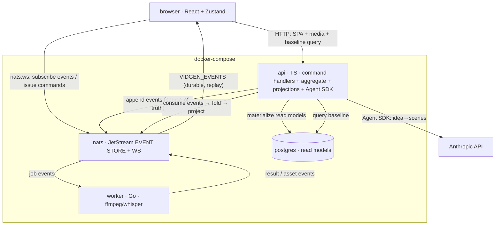

# vidgen Webapp Rewrite P5 — CLI Removal + C3 Change-Unit Implementation Plan

> **For agentic workers:** REQUIRED SUB-SKILL: Use superpowers:subagent-driven-development (recommended) or superpowers:executing-plans to implement this plan task-by-task. Steps use checkbox (`- [ ]`) syntax for tracking.

**Goal:** After P1–P4 land and the webapp works end-to-end, verify nothing from the CLI is lost, delete `cmd/vidgen/` + `internal/cli/` and the now-dead root Go module, resync `README.md`/`CLAUDE.md`/`docs/GETTING_STARTED.md` for the webapp, and author + apply exactly one C3 change-unit that re-onboards the architecture facts from a CLI-process topology to the api/worker/frontend/nats/postgres topology — never by hand-editing `.c3/`.

**Architecture:** Three phases in order: (1) pre-deletion capability-parity gate, then deletion of the CLI and the root Go module; (2) docs sync (README, CLAUDE.md, GETTING_STARTED if present); (3) one C3 change-unit (`adr-20260709-webapp-topology`) authored via the `/c3` skill's CLI handle — dissolve `c3-1`, retitle `c3-2`→`worker`, create `api`/`frontend`/`nats`/`postgres` containers, reparent/retire/create components, update `rule-cost-wall`, retire `ref-manifest-state`, add `rule-ui-state-in-store`. A final task runs the full-stack verification from the spec's OKR objective (browser-only render to a downloaded MP4, cost ≤ cap, worker tests 100%).

**Tech Stack:** Go 1.25 (`worker/` module), TypeScript/Node (`api/`), Vite/React/Zustand (`frontend/`), NATS JetStream, Postgres, docker compose, C3 CLI v11.3.0 via the `/c3` skill handle (`c3() { C3X_MODE=agent bash <c3-skill-dir>/bin/c3x.sh "$@"; }`).

**Preconditions — do not start this plan until:**
- P1 (`…-01-api-core.md`), P2 (`…-02-agent-sdk-script.md`), P3 (`…-03-go-worker.md`), P4 (`…-04-frontend-spa.md`) are merged and `docker compose up` brings up a working webapp.
- You have read `docs/superpowers/plans/2026-07-09-vidgen-webapp-00-index.md` (frozen contracts) and `docs/superpowers/specs/2026-07-09-vidgen-webapp-event-store-design.md` (design + OKR loop) in full.

**Frozen-contract note (resolve before you start authoring):** the spec's §3 "Kept / rewritten / deleted" table says, in shorthand, "Rewritten (→ TS `api`): `internal/{flow,cost,domain,config,publish}`". The index's §3 target layout — which the index header declares the single source of truth for names/paths — instead shows `worker/internal/{tts,material,caption,render,music,domain,prereq}` as **kept, re-pointed** under `worker/`. These disagree specifically on `domain` and `prereq`. This plan follows the **index**, because the index is the frozen contract and a plan may not silently relitigate it: `domain` and `prereq` are Go packages that move (are promoted) into `worker/`, not rewritten into TS. `config` is treated as split (Task 6 makes the split-or-retire decision from real evidence, see Task 6 Step 3). `flow`, `cost`, `publish` (upload logic) are rewritten into TS `api`. `script` is rewritten into TS `api` (Agent SDK, per spec decision #7). This is stated once here so every later step can just say "per the frozen-contract note" instead of re-arguing it.

---

## File Structure

- Delete: `cmd/vidgen/main.go`, then the empty `cmd/vidgen/` directory.
- Delete: `internal/cli/root.go`, `internal/cli/publish.go`, then the empty `internal/cli/` directory.
- Delete: root `go.mod`, `go.sum` (root Go module retired — `worker/go.mod` is the only remaining Go module per index §3).
- Modify: `README.md` — Installation, Usage, Architecture, Development, Roadmap sections.
- Modify: `CLAUDE.md` — Architecture (1 minute), Commands, Gotchas, Workflow sections.
- Modify (conditional): `docs/GETTING_STARTED.md` — only if P1–P4 created it (it does not exist as of this writing).
- Create (via C3 CLI, not hand-edited): `.c3/changes/adr-20260709-webapp-topology/*.patch.md`, which land as changes to `.c3/README.md` (c3-0), `.c3/c3-1-/*` (retired), `.c3/c3-2-/*` (retitled + new members), new `.c3/c3-3-/` (api), `.c3/c3-4-/` (frontend), `.c3/c3-5-/` (nats), `.c3/c3-6-/` (postgres), `.c3/rules/rule-cost-wall.md` (updated), `.c3/rules/rule-ui-state-in-store.md` (new), `.c3/refs/ref-manifest-state.md` (retired).

---

## Task 1: Pre-deletion capability-parity gate

**Files:** none modified — this task only reads code/docs and runs the running webapp. It is the safety gate the rest of the plan depends on.

- [ ] **Step 1: Build the CLI-step → webapp-command capability map**

Using `docs/superpowers/plans/2026-07-09-vidgen-webapp-00-index.md` §5 (frozen command contract) and the CLI source (`internal/cli/root.go`, `internal/cli/publish.go` — read them now, before they're deleted), fill in this exact table and paste it into the task tracker / PR description:

| CLI step | Old command (flags) | Webapp command(s) (index §5) | Verdict |
|---|---|---|---|
| `new` | `vidgen new <idea> --duration --scenes --tone --resource` | `CreateProject {idea, durationSec, sceneCount, tone}` then `GenerateScript {projectId}` (P2, Agent SDK → `ScriptGenerated`) | **GAP CHECK:** `--resource` (user-supplied local media directory) has no field in `CreateProject`'s frozen body. Confirm P1–P4 added an equivalent (upload flow, or explicit descope) before proceeding. |
| `material` | `vidgen material --project` | `ResolveMaterial {projectId}` → `vidgen.job.material.*` jobs → `MaterialResolved` | Equivalent. |
| `tune` | `vidgen tune --project --voice --speed --caption-font --caption-size --music --music-search --music-volume` | **None** in the frozen §5 command table. | **GAP CHECK:** voice/speed/caption/music selection has no listed webapp command. Confirm with the P4 implementer whether this was folded into `CreateProject`'s body, exposed as a later-added command, or explicitly descoped for v1 (defaults only). Do not delete the CLI until this is answered — see Step 3. |
| `confirm` | `vidgen confirm --project` (shows projected cost, gates on `CheckProjected`) | `CostProjected` event appended as part of `GenerateVoiceovers` (§5); no standalone pre-spend review step | **SHAPE CHANGE, not a gap:** the storyboard-approval gate (`RequestApproval` → `AwaitingApproval` → `ApproveStoryboard`, spec §2.7) replaces "review manifest before any spend" with "review after TTS is already synthesized, before render." Confirm this reordering was a deliberate spec decision (it is — spec §2.7) and not an accidental loss of the pre-spend checkpoint. The admissibility check itself (spec §6, `rule-cost-wall`) still fires before `GenerateVoiceovers` dispatches jobs, so the cost wall itself is not weakened — only the manual review's timing moved. |
| `generate` | `vidgen generate --project --output` | `GenerateVoiceovers` (dispatches tts+caption jobs) then `ApproveStoryboard` (dispatches render job) | Equivalent, split across two commands plus the approval gate. |
| `publish` | `vidgen publish --project --caption --privacy --force` | `Publish {projectId, caption, privacy}` → `Published` | Equivalent. **Note:** `--force` (re-publish) has no explicit field in the frozen `Publish` body — confirm re-publish is either allowed unconditionally by the new handler or explicitly out of scope; not a hard blocker (re-publish is a minor edge case), but log it. |
| `list` | `vidgen list` | `GET /api/state` | Equivalent. |

- [ ] **Step 2: Resolve every GAP CHECK row**

For the `--resource` and `tune` gaps specifically: read the actual `api/src/commands.ts` and `frontend/src/` (created by P1/P4) and confirm the real behavior. If either gap is genuinely unresolved (no webapp path to set voice/speed/caption/music, or no way to seed a project from local assets), **STOP** — per this repo's "Pre-existing Issues" policy, do not silently proceed. Report the gap to the user with exactly what's missing and ask: bypass (ship v1 without it, documented as a known limitation in README's Roadmap) or fix (pause CLI removal, route the fix back through the P4/P1 plan). Do not delete the CLI while a real user capability has no webapp path.

- [ ] **Step 3: Run the objective verification (the okra-frame E2E)**

This is the spec's §5.1 objective made concrete: *"One real short video produced end-to-end through the webapp, zero CLI... 6/6 stages + 1 finished video."*

```bash
docker compose up -d --build
docker compose ps
```
Expected: 5 services (`nats`, `postgres`, `api`, `worker`, `frontend`) all show `Up`/`healthy` (exact health-check names come from `docker-compose.yml` as extended by P1 — read it now for the real service names/ports if they differ from this list).

Then, using only the browser (no CLI, no direct `curl`/`nats` calls) against the frontend URL from `docker-compose.yml`:
1. Create a project (idea + duration + scenes + tone) via the New Project form.
2. Wait for the script to appear (scene list rendered from `ScriptGenerated`).
3. Trigger material resolution; wait for all scenes to show resolved media.
4. Trigger voiceover generation; wait for the projected-cost display (`CostProjected`) and the storyboard/approval UI (`AwaitingApproval`).
5. Approve the storyboard (`ApproveStoryboard`).
6. Wait for `RenderCompleted`; download the rendered MP4 from the browser.
7. Publish (or explicitly skip if no publish provider is configured — note which).

Expected: all 6 stages (new, material, tune/script, confirm, generate+approve, publish) are reachable browser-only, and one playable MP4 is downloaded. Record the actual per-video cost shown by the UI/ledger — it must be `≤ COST_CAP_USD` (spec §5.2, default `$0.15`). If any stage requires a CLI command or direct NATS/HTTP call to complete, that stage fails this gate — **STOP**, do not proceed to Task 2, escalate to the user.

- [ ] **Step 4: Record the gate result**

Write the filled-in table from Step 1, the resolution of every GAP CHECK, and the Step 3 E2E result (pass/fail, cost observed, screenshot or downloaded file path) into the PR description or a `docs/superpowers/plans/2026-07-09-vidgen-webapp-05-gate-result.md` scratch note (not committed as permanent documentation — delete it once the PR is merged, or fold the essential parts into the PR body). Only proceed to Task 2 once every row is "Equivalent" or explicitly accepted as a documented v1 limitation by the user.

---

## Task 2: Delete the CLI and retire the root Go module

**Files:**
- Delete: `cmd/vidgen/main.go`, `cmd/vidgen/` (dir)
- Delete: `internal/cli/root.go`, `internal/cli/publish.go`, `internal/cli/` (dir)
- Delete: `go.mod`, `go.sum` (root)

- [ ] **Step 1: Confirm the CLI currently builds (sanity baseline)**

Run: `go build -o /tmp/vidgen-old ./cmd/vidgen`
Expected: succeeds, produces `/tmp/vidgen-old`. (Proves the thing you're about to delete is real, working code — not already broken/orphaned.)

- [ ] **Step 2: Check for stray root Go packages beyond `internal/cli`**

Run: `ls internal/`
Expected (if P1–P4 fully promoted/rewrote everything per the frozen-contract note): only `cli` remains at root under `internal/`. Everything else (`bus`, `caption`, `config`, `cost`, `domain`, `flow`, `material`, `music`, `prereq`, `publish`, `render`, `script`, `tts`, `videogen`, `worker`) should already be gone from root — either promoted into `worker/internal/` (P3) or rewritten into `api/src/` (P1/P2) and deleted at their old root location.

If anything besides `cli` still shows up: **STOP.** This is a P1–P4 completion gap, not something P5 has authority to resolve by deleting extra packages on its own judgment (P5's job is CLI removal + C3, not silently absorbing leftover migration work from earlier plans). Report exactly which root `internal/*` directories are unexpectedly still present and ask the user whether P5 should also delete them now (because P1–P3 did a copy, not a move, and the root copies are confirmed dead) or whether this indicates an incomplete P1–P4 migration that needs to be fixed first.

- [ ] **Step 3: Delete `cmd/vidgen/` and `internal/cli/`**

```bash
git rm -r cmd/vidgen internal/cli
```
Expected: `rm 'cmd/vidgen/main.go'`, `rm 'internal/cli/publish.go'`, `rm 'internal/cli/root.go'` — both directories gone.

- [ ] **Step 4: Confirm no remaining root Go file imports the root module**

Run: `grep -rl "github.com/cuongtranba/video-generation-skill" --include=*.go . 2>/dev/null | grep -v '^./worker/'`
Expected: empty output. (`worker/` has its own `go.mod` with its own module path per index §3 — it must not import the retired root module path at all; if this grep finds a hit inside `worker/`, that's a P3 bug to report, not something to patch here.)

- [ ] **Step 5: Retire the root Go module**

```bash
git rm go.mod go.sum
```
Expected: both removed. Then confirm there is genuinely no Go source left at root:

Run: `find . -name "*.go" -not -path "./worker/*"`
Expected: empty output.

- [ ] **Step 6: Confirm `worker/` is unaffected**

```bash
cd worker && go build ./... && go vet ./... && go test ./...
```
Expected: build succeeds, vet clean, all tests pass. `worker/` is a self-contained module (own `go.mod`) — this step proves deleting the root module didn't touch it.

- [ ] **Step 7: Commit**

```bash
git add -A
git commit -m "chore(p5): delete CLI (cmd/vidgen, internal/cli) and retire the root Go module"
```

---

## Task 3: Docs sync — `README.md`

**Files:** Modify `README.md` (sections below; line numbers are from the pre-P5 CLI-era README read during research — re-locate by heading text since exact line numbers may drift after P1–P4 touch this file).

The README is CLI-centric top to bottom (tagline, Installation, Usage numbered `./vidgen <step>` commands, Architecture diagram, package table). Do not attempt a silent partial edit — replace every section below with the given skeleton. This is a skeleton (real headings + real bullet content sourced from the frozen contracts), not a full prose rewrite — flesh out exact wording when you have the real P1–P4 code in front of you.

- [ ] **Step 1: Tagline + intro (top of file, before "## Demo")**

Replace "CLI tool that turns an idea into..." with: a one-paragraph description that the tool is now a **webapp** (`docker compose up`, browser UI), same pipeline (idea → script → stock material → FPT.AI TTS → whisper captions → FFmpeg render), same 9:16/15–90s/Vietnamese-voiced output. Drop the terminal-command example block (`"3 lý do..." → 21s MP4...`) or keep it as illustrative output only, not as a command.

- [ ] **Step 2: "## Installation" → replace entirely**

Skeleton:
```markdown
## Installation

Requires Docker + Docker Compose. Provider API keys still live in `.env` at the repo root (gitignored) — see Configuration below.

git clone https://github.com/cuongtranba/video-generation-skill
cd video-generation-skill
docker compose up --build
```
Remove `go build -o vidgen ./cmd/vidgen` and the standalone `brew install ffmpeg`/`whisper`/`claude CLI` bullets — those binaries now live inside the `worker` container image (built by its `Dockerfile`, per index §3); confirm this against the real `worker/Dockerfile` and adjust the skeleton if any host-side prerequisite remains (e.g., Docker itself, or a `.env` requirement).

- [ ] **Step 3: "## Configuration" and "## Provider configuration" → update, don't remove**

`.env` keys are unchanged (`FPT_TTS_API_KEY`, `PEXELS_API_KEY`, `PIXABAY_API_KEY`, `JAMENDO_CLIENT_ID`, `TIKTOK_ACCESS_TOKEN`) — add `COST_CAP_USD` (default `0.15`, index §6) to the table. Provider selection (`~/.vidgen/config.yaml`) — confirm with the real P3 output whether this YAML file still exists (mounted into the `worker` container) and update the path/mechanism accordingly; if provider selection moved to a different location (e.g. `worker/config.yaml` committed to the repo, or environment variables), update the skeleton to match reality rather than leaving the old `~/.vidgen/config.yaml` path, which assumed a local single-user filesystem that no longer exists once this runs in a container.

- [ ] **Step 4: "## Usage" → replace the 6 numbered CLI commands**

Skeleton:
```markdown
## Usage

1. Open the frontend at the URL printed by `docker compose up` (see `docker-compose.yml` for the mapped port).
2. **New Project** — idea, duration, scene count, tone.
3. Watch the live board: script scenes appear, then resolved material per scene.
4. **Generate voiceovers** — projected cost shown before commit; storyboard approval gate appears once TTS + captions are ready.
5. **Approve** — triggers the final render; watch for the rendered MP4.
6. **Download** the MP4, or **Publish** it to the configured platform.
7. All projects and their live status are visible on the board (replaces `vidgen list`).
```
Remove the `--voice`/`--speed`/`--caption-*`/`--music*` flag tables ("### Voices (FPT.AI)", "### Tune flags") only if Task 1 Step 2 confirmed those controls exist somewhere in the webapp UI — if so, replace the flag tables with the equivalent UI control description (which form/panel sets voice, speed, caption style, music); if Task 1 Step 2 concluded these are v1-descoped, keep a shortened table noting the fixed defaults now in effect instead of deleting the information outright.

- [ ] **Step 5: "## Architecture" → replace the mermaid diagram and package table**

Replace the `flowchart TB` CLI/bus diagram with the spec's topology diagram (verbatim from `docs/superpowers/specs/2026-07-09-vidgen-webapp-event-store-design.md` §2.2):



Replace the `| Package | Responsibility |` table with a service table (spec §2.1):

| Service | Lang | Role |
|---|---|---|
| `nats` | — | JetStream event store (`VIDGEN_EVENTS`, `VIDGEN_JOBS`) + WebSocket listener |
| `postgres` | — | read-model projections, rebuildable from the event log |
| `api` | TypeScript/Node | command handlers, Project aggregate, Agent SDK script gen, cost-wall admissibility, projections, serves SPA + media |
| `worker` | Go | consumes job events, runs ffmpeg+libass/whisper (tts/material/caption/render), emits result/asset events |
| `frontend` | Vite/React/TS/Zustand | SPA; served by `api` in prod |

Drop the "### Design notes" bullets about "NATS in-process" (no longer true — NATS is now external infra) and rewrite the idempotency bullet to describe both layers: worker output-exists check (unchanged) **and** event-append `Nats-Msg-Id` dedup at the api aggregate (index §4).

- [ ] **Step 6: "## Development" → replace root Go commands with per-service commands**

Skeleton:
```markdown
## Development

cd worker && go test ./...                                    # Go worker unit tests
cd worker && go test -tags=integration ./internal/render/...  # real FFmpeg render test
cd worker && go vet ./...
cd api && npm test
cd frontend && npm test && npm run lint
docker compose up --build                                     # full stack
```

- [ ] **Step 7: "## Roadmap" → drop the completed line, note any accepted gaps**

Remove "**v2** — webapp, ...". If Task 1 Step 2 accepted any v1 limitation (e.g., no browser-only local-asset upload, or fixed voice/music defaults), add it here as a known limitation with a one-line note, so it's documented rather than silently missing.

- [ ] **Step 8: Commit**

```bash
git add README.md
git commit -m "docs: rewrite README for the webapp (docker compose, browser flow)"
```

---

## Task 4: Docs sync — `CLAUDE.md`

**Files:** Modify `CLAUDE.md`.

- [ ] **Step 1: Header line**

Replace `Go CLI generating 9:16 Vietnamese-voiced short videos: idea → script → stock material → FPT.AI TTS → whisper captions → FFmpeg render.` with the webapp equivalent: a multi-service webapp (api/worker/frontend/nats/postgres, docker compose) generating the same output. Keep "Full docs in README.md."

- [ ] **Step 2: "## Architecture docs (C3)" section**

Update the prose describing "`c3-1` (CLI process) and `c3-2` (message-bus/async plane)" to the post-change-unit topology: `c3-1` retired; `c3-2` retitled to the `worker` container; new containers `c3-3` (api), `c3-4` (frontend), `c3-5` (nats), `c3-6` (postgres). This section can only be finalized **after** Task 6/7 (the C3 change-unit) actually apply — do this edit last, using the real ids the change-unit landed with (confirm via `c3 list --flat` after apply), not the proposed ids from this plan, in case numbering shifted.

- [ ] **Step 3: "## Commands" section → replace root Go commands**

Skeleton:
```markdown
## Commands

docker compose up --build       # full stack: nats, postgres, api, worker, frontend
cd worker && go test ./...      # Go worker unit tests — must stay green
cd worker && go test -tags=integration ./internal/render/...   # real FFmpeg render (needs libass build)
cd worker && go vet ./...       # must be clean
cd api && npm test
cd frontend && npm test && npm run lint
```

- [ ] **Step 4: "## Architecture (1 minute)" → rewrite bullets**

Replace the `cmd/vidgen → internal/cli → internal/flow` bullet and the JSON-manifest bullet with:
- `browser (React+Zustand)` → `api` (HTTP commands + NATS event store) → `worker` (Go media jobs); event-sourced: `VIDGEN_EVENTS` (NATS JetStream) is the source of truth, Postgres is a disposable read-model projection (spec §2.5).
- `generate` flow: `api` dispatches `vidgen.job.<kind>.<projectId>.<scene>` jobs to `worker`; idempotent both at the worker (output-exists check, `ref-idempotent-worker`, unchanged) and at event-append (`Nats-Msg-Id`, index §4).
- **Cost wall**: `COST_CAP_USD` (default `0.15`) enforced in the `api` aggregate at command admissibility — projected at `GenerateVoiceovers`, actual read from the `cost_ledger` projection. `ScriptGenerated.scriptUsd = 0` always (Agent SDK's `total_cost_usd` is notional under a Claude subscription and must never enter the enforced total — spec §6 / Risks). Never remove or weaken these checks.
- External binaries (`ffmpeg`, `ffprobe`, `whisper`) resolved inside the `worker` container by `internal/prereq` (unchanged, now containerized).
- Providers (`tts`/`material`/`music`) selected via `worker`'s config (confirm exact mechanism against real P3 code — see Task 3 Step 3 note); publish (TikTok) now lives in the `api` command handler (TypeScript).

- [ ] **Step 5: "## Conventions" → add a TS/frontend subsection, keep the Go one scoped to `worker/`**

Keep the existing Uber Go style bullets but scope them explicitly to `worker/` (they no longer apply repo-root-wide since there is no root Go module). Add: TypeScript conventions for `api`/`frontend` — no `any`/unnarrowed `unknown` (matches this repo's global Strong Typing rule), ESLint local-state ban in `frontend/src/components/**` (spec §2.8), TDD still required.

- [ ] **Step 6: "## Gotchas" → keep the still-true ones, add new ones**

Keep: ffmpeg/libass tap requirement, zoompan frame semantics, stock-clip-shorter-than-narration loop math, FPT.AI async polling, Whisper VN caption splitting, Pixabay-no-music-API (all still true inside `worker`). Drop: "claude CLI json output is an ARRAY of messages" (no longer applicable — script generation is now the Agent SDK, not a `claude` CLI subprocess). Add new ones learned from P1–P4 (Agent SDK notional-cost trap already covered in Step 4; NATS `Nats-Msg-Id` dedup window is 2 minutes per index §4 — a retry outside that window double-appends).

- [ ] **Step 7: "## Keys (.env, gitignored)" → add `COST_CAP_USD`**

Same key list plus `COST_CAP_USD` (not a secret, but document it here since it's the operator-set safety cap, per spec §5.2 "the cap is a configuration value").

- [ ] **Step 8: "## Workflow" → update the verification line**

Replace `./vidgen generate` on an existing project re-runs at $0 (idempotent TTS) with: `docker compose up` then re-driving the same project through the browser re-runs at $0 (worker output-exists skip is unchanged; verify via the `cost_ledger` projection showing no new `VoiceSynthesized` charge on the re-run).

- [ ] **Step 9: Commit**

```bash
git add CLAUDE.md
git commit -m "docs: rewrite CLAUDE.md for the webapp topology"
```

---

## Task 5: Docs sync — `docs/GETTING_STARTED.md` (conditional)

**Files:** Modify `docs/GETTING_STARTED.md` if it exists; otherwise no-op.

- [ ] **Step 1: Check existence**

Run: `test -f docs/GETTING_STARTED.md && echo EXISTS || echo ABSENT`

- [ ] **Step 2a: If ABSENT**

No action. As of this plan's authoring, `docs/GETTING_STARTED.md` does not exist in the repo — the task brief referenced it defensively in case P1–P4 introduced it. Record "ABSENT — no-op" in the PR description so reviewers don't wonder why this task is empty.

- [ ] **Step 2b: If EXISTS**

Read it in full, then apply the same category of changes as README.md Task 3: any `go build`/`./vidgen <cmd>` instructions → `docker compose up --build` + browser flow; any `~/.vidgen/config.yaml`/`~/.vidgen/projects/<id>` filesystem-state references → event-sourced/Postgres-projection equivalents; any prerequisite install instructions (ffmpeg/whisper/claude CLI) → containerized-in-`worker`, only `Docker` required on the host. Use the exact skeleton content from Task 3 Steps 2, 4, 6 as the source of truth for wording, so README and GETTING_STARTED don't drift from each other.

- [ ] **Step 3: Commit (only if Step 2b applied)**

```bash
git add docs/GETTING_STARTED.md
git commit -m "docs: rewrite GETTING_STARTED for the webapp"
```

---

## Task 6: C3 change-unit — author the ADR and every patch

**Files:** Create `.c3/changes/adr-20260709-webapp-topology/adr-body.md` (scratch, authored outside `.c3/` per the C3 skill's own warning, then fed via `--file`) and `.c3/changes/adr-20260709-webapp-topology/*.patch.md` (the actual carriers, written directly into that directory once `c3 change new` scaffolds it).

**Setup — do this once per shell session:**
```bash
c3() { C3X_MODE=agent bash <path-to-c3-skill-dir>/bin/c3x.sh "$@"; }
c3 --version
```
(Resolve `<path-to-c3-skill-dir>` from the `/c3` skill's own `Base directory` line, e.g. `~/.claude/skills/c3`.)

- [ ] **Step 1: Baseline the current topology**

```bash
c3 list --flat
```
Expected: shows `c3-0` (system), `c3-1`/`c3-2` (containers), 14 components (`c3-101..115` minus gaps, `c3-201`, `c3-210`), 3 refs, 5 rules — confirms nothing has drifted from what this plan was authored against. If the ids or counts differ, re-read the live `.c3/` facts (via `c3 read`/`c3 lookup`, never raw `Read`/`Glob` on `.c3/` — per the skill's hard rule) before continuing, and adjust the target ids below accordingly.

- [ ] **Step 2: File-context gate — `c3 lookup` on every file whose owning component changes**

```bash
c3 lookup 'worker/internal/**'
c3 lookup 'api/src/**'
c3 lookup 'frontend/src/**'
```
This is mandatory before authoring any fact-edit patch (per the C3 skill's change reference: "the body you author must already comply" with every governing ref/rule). Read the `rule-*` and `ref-*` hits for each and keep them in mind while writing patch bodies in the steps below — especially `rule-no-any-data` (TS: no `any`/unnarrowed `unknown`), `rule-error-wrap`, `rule-di-constructor` for the Go side, and `rule-cost-wall`/`ref-idempotent-worker` wherever they still apply.

- [ ] **Step 3: Resolve the `config`/`c3-102` and `videogen`/`c3-105` open questions from real evidence**

Per the frozen-contract note, these two are genuinely ambiguous from the index/spec alone. Resolve with real commands, not assumption:

```bash
test -d worker/internal/config && echo "worker keeps config" || echo "worker has no config package"
test -d worker/internal/videogen && echo "worker keeps videogen" || echo "worker has no videogen package"
```

- If `worker/internal/config` exists → `c3-102` is **reparented** to worker (Step 6 below uses the reparent patch). If it does not (provider selection moved fully server-side into `api`, e.g. env vars per-service) → `c3-102` is **retired** and a new `config`-equivalent understanding is folded into the `c3-302 commands-http` component's Purpose text instead (no separate fact).
- If `worker/internal/videogen` exists → `c3-105` is **reparented** to worker unchanged (it was always a contract-only seam with no live implementation, so this is likely — Go doesn't need to change for an unimplemented interface). If it does not (P3 dropped the unused seam as YAGNI) → `c3-105` is **retired**, with a one-line note in the ADR's Context that the clip-generation seam was dropped as unused rather than migrated.

Record which branch applies in the ADR body (Step 4) — don't leave both branches ambiguous in the landed patches; author only the branch that matches reality.

- [ ] **Step 4: Draft the ADR body**

Create `/tmp/adr-webapp-topology-body.md` (outside `.c3/` — it's a managed tree that drops stray scratch files between commands) with this content, filling in the `config`/`videogen` verdict from Step 3 and the real service ports/paths confirmed in Task 1/3:

```markdown
## Goal

Re-onboard the C3 topology from a single operator-facing CLI process to the webapp rewrite: dissolve the CLI-process container, retitle the message-bus container into the Go media worker, and add the api/frontend/nats/postgres containers — so the frozen architecture facts describe the system that is actually deployed (docker compose: nats, postgres, api, worker, frontend), not the CLI that preceded it.

## Context

`vidgen` changed from a single-binary Go CLI (`cmd/vidgen` → `internal/cli` → `internal/flow`, state = JSON manifest on the local filesystem) into a 5-service webapp: NATS JetStream as an append-only **event store** (source of truth, not just a job bus), Postgres as a disposable read-model projection, a TypeScript `api` service owning command handlers/the Project aggregate/Agent SDK script generation/cost admissibility, a Go `worker` service kept for ffmpeg/whisper media work, and a Vite/React/Zustand `frontend` SPA talking to NATS directly over WebSocket. This ADR is the change-unit that lands that shift as C3 facts, per `docs/superpowers/specs/2026-07-09-vidgen-webapp-event-store-design.md` §2–4. The CLI (`cmd/vidgen`, `internal/cli`) is deleted (this plan's Task 2); `claude` CLI script generation is replaced by the Claude Agent SDK.

## Decision

- Retire `c3-1` (vidgen CLI process) — every one of its 12 components either moves (reparents) to the worker container or is retired in favor of a new TS component under a new `api` container, in this same unit, so no live child is ever orphaned.
- Retitle `c3-2` from "Message bus / async execution plane" to "worker — Go media execution service" (same id, same lineage — spec §4: "worker (retains c3-2 lineage)"). `c3-210` (worker) stays under it, Purpose updated for the external event store. `c3-201` (bus) is retired — "embedded NATS, no TCP port" is no longer true; NATS is now its own deployed container.
- Add four new containers under `c3-0`: `api` (TS command handlers, aggregate, cost, Agent SDK script, projections), `frontend` (Vite/React/Zustand SPA), `nats` (JetStream event store, external infra), `postgres` (read-model projections, external infra).
- Reparent (Go, unchanged language, `worker/internal/*` per index §3): `c3-101` domain, `c3-103` prereq, `c3-112` material, `c3-113` audio-synthesis, `c3-114` visual-assembly[, `c3-102` config, `c3-105` videogen — per Step 3's verdict].
- Retire (Go implementation deleted, replaced by a new TS component under `api`): `c3-104` cost, `c3-106` cli, `c3-110` flow, `c3-111` script[, `c3-102` config, `c3-115` publish — per Step 3's verdict for config; publish always retires, folded into `c3-302`].
- `rule-cost-wall` preserved, updated: cap is now `COST_CAP_USD` (config, default `$0.15`), enforced in the `api` aggregate at command admissibility (not a Go `Ledger`); Golden Example re-sourced from `api/src/cost.ts`; add the Agent SDK notional-cost anti-pattern.
- `ref-manifest-state` retired: no fact cites it after this unit lands (its only citers, `c3-101` domain and `c3-110` flow, either drop the citation on reparent or retire); the JSON-manifest-as-source-of-truth pattern no longer exists — event log + Postgres projection replaces it. (No replacement ref authored in this unit — YAGNI; author one later if the event-sourcing pattern needs its own governance doc beyond what `nats`'s container Responsibilities already states.)
- New rule `rule-ui-state-in-store` added (frontend: single Zustand store owns all state/logic; components are pure; ESLint bans local state — spec §2.8). Golden Example deferred to a follow-up patch once real `frontend/src/store/*.ts` exists to cite literally (rule schema requires literal code, not invented code) — see Task 7 Step 6.
- `c3-0` system Goal rewritten (CLI → webapp); Abstract Constraints table rows citing `c3-1` re-pointed to `api`/`worker` as appropriate, or replaced (the manifest-state constraint row is replaced by an event-sourced-state constraint row).

## Affected Topology

(fill from `c3 change view adr-20260709-webapp-topology` once patches are authored — Task 6 Step 12)

## Compliance Refs / Rules

(fill from the actual `uses:` sets on the new/reparented components once authored)

## Verification

(fill from Task 7 — `c3 check`, `c3 eval`, `go test`/`npm test`/`docker compose up` results)
```

Then:
```bash
c3 schema adr
c3 add adr webapp-topology --file /tmp/adr-webapp-topology-body.md
```
Expected: `c3 add` succeeds and reports `id: adr-20260709-webapp-topology` (or whatever id convention the live tool assigns — if it differs from this plan's assumed id, use the real one for every command below).

- [ ] **Step 5: Scaffold the patch folder**

```bash
c3 change new adr-20260709-webapp-topology
```
Expected: creates `.c3/changes/adr-20260709-webapp-topology/`.

- [ ] **Step 6: Author the 4 new-container `whole` patches**

Write these four files directly into `.c3/changes/adr-20260709-webapp-topology/`:

`01-container-api.patch.md`:
```markdown
---
target: c3-3
scope: whole
type: container
parent: c3-0
boundary: TypeScript/Node service; command handlers, Project aggregate, Agent SDK script generation, cost admissibility, projections, serves the SPA + media
---
## Goal

Be the write-side and read-side composition root for the webapp: validate and admit every command against the Project aggregate and the cost wall, append the resulting events to the NATS event store, dispatch media jobs to the worker, materialize Postgres read models from the event log, and serve the frontend SPA plus rendered media over HTTP.

## Components

| ID | Name | Category | Status | Goal Contribution |
|---|---|---|---|---|

## Responsibilities

Owns the command surface (`POST /api/commands/<name>`), the Project aggregate (`foldProject`), the Claude Agent SDK script-generation service, the cost ledger and `COST_CAP_USD` admissibility check, the durable projection consumer that materializes `VIDGEN_EVENTS` into Postgres, and the REST baseline (`GET /api/state`, `GET /api/projects/:id`, `GET /media/<projectId>/<file>`). Delegates media work (tts/material/caption/render) to the `worker` container via job events; never does media work itself.
```

`02-container-frontend.patch.md`:
```markdown
---
target: c3-4
scope: whole
type: container
parent: c3-0
boundary: Vite/React/TS SPA, browser-only, no server-side logic beyond static serving
---
## Goal

Be the single browser surface for the webapp: subscribe to the NATS event store directly over WebSocket, render the live project board, dispatch commands to `api`, and gate render on the storyboard-approval flow — with all state and side effects centralized in one Zustand store so components stay pure and testable.

## Components

| ID | Name | Category | Status | Goal Contribution |
|---|---|---|---|---|

## Responsibilities

Owns the `nats.ws` browser connection and ordered event consumer, the single Zustand store (state + event-fold reducers + command thunks + connection lifecycle), and the pure presentational components that read store selectors and dispatch store actions only. Enforces (via ESLint) that no component holds local state or logic outside the store.
```

`03-container-nats.patch.md`:
```markdown
---
target: c3-5
scope: whole
type: container
parent: c3-0
boundary: External NATS JetStream service (docker-compose `nats`), file-backed persistence, TCP for services + WebSocket for the browser
---
## Goal

Be the append-only event store and job queue that is the system's single source of truth: `VIDGEN_EVENTS` (subjects `vidgen.evt.<projectId>.<eventType>`, limits/none retention for full replay) and `VIDGEN_JOBS` (subjects `vidgen.job.<kind>.<projectId>.<scene>`, work-queue retention), reachable by `api`/`worker` over TCP and by the browser directly over WebSocket.

## Components

| ID | Name | Category | Status | Goal Contribution |
|---|---|---|---|---|

## Responsibilities

Persists every domain event durably and in order per project; guarantees at-least-once job delivery to `worker`; deduplicates event appends via `Nats-Msg-Id` (2-minute window) so retries never double-append. Owns no business logic — `api` and `worker` are the only writers/interpreters of what's on the streams.
```

`04-container-postgres.patch.md`:
```markdown
---
target: c3-6
scope: whole
type: container
parent: c3-0
boundary: External Postgres service (docker-compose `postgres`), disposable — fully rebuildable by replaying `VIDGEN_EVENTS` from sequence 0
---
## Goal

Hold the queryable read-model projections (`projects`, `scenes`, `assets`, `cost_ledger`) that `api` materializes from the event log, so baseline REST reads don't require folding the full event stream on every request.

## Components

| ID | Name | Category | Status | Goal Contribution |
|---|---|---|---|---|

## Responsibilities

Stores derived, disposable state only — never the source of truth. `DROP` + replay from `VIDGEN_EVENTS` seq 0 must fully rebuild every table; any read model that can't be rebuilt this way is a bug in the projection, not a reason to treat Postgres as authoritative.
```

- [ ] **Step 7: Author the `c3-2` retitle + Goal update (`frontmatter` + `block` patches)**

```bash
c3 read c3-2 --section Goal --cite
```
Copy the returned `entity@vVER:sha256:...` (frontmatter-scope, whole-entity anchor) and `c3-2#nNODE@vVER:sha256:...` (block-scope, Goal-section anchor) into the two patches below.

`05-frontmatter-c3-2-worker.patch.md`:
```markdown
---
target: c3-2
scope: frontmatter
base: <entity anchor from c3 read c3-2 --cite>
title: worker — Go media execution service
---
```

`06-block-c3-2-goal.patch.md`:
```markdown
---
target: c3-2
scope: block
base: <c3-2 Goal block anchor from c3 read c3-2 --section Goal --cite>
---
## Goal

Be the Go media execution service that consumes job events off the external NATS event store and fans generation work out across idempotent workers — parallel per-scene TTS, then caption, then render — publishing result/asset events back to the event store with `Nats-Msg-Id` idempotency so redelivery and re-runs never repeat paid or slow work.
```

- [ ] **Step 8: Author the mechanical component reparents (`frontmatter` patches, same shape for each)**

For each row below: run `c3 read <id> --cite` to get the entity anchor, then author `.c3/changes/adr-20260709-webapp-topology/<seq>-frontmatter-<id>.patch.md`:

```markdown
---
target: <id>
scope: frontmatter
base: <entity anchor>
parent: c3-2
---
```

| Seq | id | Always reparent? |
|---|---|---|
| 07 | c3-101 (domain) | Yes |
| 08 | c3-112 (material) | Yes |
| 09 | c3-113 (audio-synthesis) | Yes |
| 10 | c3-114 (visual-assembly) | Yes |
| 11 | c3-103 (prereq) | Yes |
| 12 | c3-102 (config) | Only if Step 3 verdict was "reparent" |
| 13 | c3-105 (videogen) | Only if Step 3 verdict was "reparent" |

For each reparented component, also author a companion `block` patch on its **Purpose** section removing any now-false claim (e.g. `c3-101` domain's Purpose currently says it owns `ManifestStore` persisting `~/.vidgen/projects/<id>/manifest.json` — that's gone; the worker-side `domain` package now owns only the concrete value types, e.g. `Scene`/`Voice`/`Speed`/`CaptionStyle`, consumed as job payloads). Get the fresh block cite via `c3 read <id> --section Purpose --cite` and write the corrected Purpose prose from what P3's actual `worker/internal/domain` package contains — read that package now, don't guess.

- [ ] **Step 9: Author the component retires (`retire` patches)**

For each of `c3-104` (cost), `c3-106` (cli), `c3-110` (flow), `c3-111` (script), `c3-115` (publish)[, `c3-102` (config) if Step 3 verdict was "retire"], `c3-105` (videogen) if Step 3 verdict was "retire"]:

```bash
c3 read <id> --cite
```

`<seq>-retire-<id>.patch.md`:
```markdown
---
target: <id>
scope: retire
base: <entity anchor>
---
```

- [ ] **Step 10: Author the `api` component `whole` (create) patches**

Five components under `c3-3`, replacing the retired components' responsibilities. IDs: `c3-301` aggregate, `c3-302` commands-http, `c3-303` cost, `c3-304` script, `c3-305` projections.

`19-component-c3-301-aggregate.patch.md`:
```markdown
---
target: c3-301
scope: whole
type: component
parent: c3-3
category: foundation
title: aggregate — event catalogue & Project fold
---
## Goal

Define the frozen event catalogue and fold a project's event stream into its current `ProjectState`, so every command handler and every projection reads the same deterministic truth.

## Parent Fit

| Field | Value |
|---|---|
| Parent | c3-3 api |
| Layer | Foundation — depended on by commands-http, projections |
| Depends on | none (pure functions over the event union) |
| Consumed by | c3-302 commands-http, c3-305 projections |

## Purpose

Owns the `VidgenEvent` TS union (11 types, `v:1`, promoted verbatim from `spikes/event-model/events.ts`) and `foldProject(events) → ProjectState`. Non-goals: no I/O, no NATS/Postgres calls — pure state-transition logic only.

## Governance

| Reference | Type | Governs | Precedence | Notes |
|---|---|---|---|---|
| rule-no-any-data | rule | `VidgenEvent`/`ProjectState` modeled as concrete typed unions/interfaces | Must | no `any`/unnarrowed `unknown` |

## Contract

| Surface | Direction | Contract | Boundary | Evidence |
|---|---|---|---|---|
| `foldProject(events)` | IN/OUT | Deterministic reduce over ordered events → `ProjectState` | Pure, no side effects | api/src/aggregate.ts |
| `VidgenEvent` union | IN/OUT | 11 frozen event shapes, field shapes not alterable without a spec change | index §4 frozen | api/src/events.ts |

## Derived Materials

| Material | Must derive from | Allowed variance | Evidence |
|---|---|---|---|
| frontend's incremental fold (`applyEvent`) | Contract | must reuse the same fold logic, not reimplement it | frontend/src/store/*.ts |
```

`20-component-c3-302-commands-http.patch.md`:
```markdown
---
target: c3-302
scope: whole
type: component
parent: c3-3
category: foundation
title: commands-http — command handlers, dispatch & REST surface
---
## Goal

Be the composition root and write-side entrypoint: validate every command against the folded aggregate and cost admissibility, append the resulting event(s), dispatch worker jobs, serve the SPA/baseline/media over HTTP.

## Parent Fit

| Field | Value |
|---|---|
| Parent | c3-3 api |
| Layer | Feature — the orchestrator over aggregate/cost/script/projections |
| Depends on | c3-301 aggregate, c3-303 cost, c3-304 script, c3-305 projections |
| Consumed by | frontend (HTTP), worker (job dispatch) |

## Purpose

Owns the 7 frozen command handlers (`CreateProject`, `GenerateScript`, `ResolveMaterial`, `GenerateVoiceovers`, `RequestApproval`, `ApproveStoryboard`, `Publish` — index §5), each folding the aggregate, checking invariants + cost admissibility before dispatch, appending events with idempotency-key-derived `Nats-Msg-Id`. Also owns the `Publish` command's actual TikTok upload call (absorbing the old `internal/publish` responsibility — no separate worker job for publish). Non-goals: no media work, no direct Postgres writes (reads via c3-305's projections only).

## Governance

| Reference | Type | Governs | Precedence | Notes |
|---|---|---|---|---|
| rule-cost-wall | rule | Every spend-triggering command checks projected cost before dispatch | Authoritative | via c3-303 cost |
| rule-no-any-data | rule | Command bodies are concrete typed interfaces, no `any` | Must | one interface per command |

## Contract

| Surface | Direction | Contract | Boundary | Evidence |
|---|---|---|---|---|
| `POST /api/commands/<name>` | IN | Validates, appends event(s), dispatches jobs | idempotencyKey required | api/src/commands.ts, api/src/http.ts |
| `GET /api/state`, `GET /api/projects/:id` | OUT | Reads from Postgres projection | Baseline only, not source of truth | api/src/http.ts |

## Derived Materials

| Material | Must derive from | Allowed variance | Evidence |
|---|---|---|---|
| frontend command thunks | Contract | one thunk per command, same body shape | frontend/src/store/*.ts |
```

`21-component-c3-303-cost.patch.md`:
```markdown
---
target: c3-303
scope: whole
type: component
parent: c3-3
category: foundation
title: cost — budget projection & the enforced ledger
---
## Goal

Project the USD cost of a video and enforce `COST_CAP_USD` at both projection (before dispatch) and actual (read from the ledger after a run), so a misconfigured or runaway run can never spend beyond budget.

## Parent Fit

| Field | Value |
|---|---|
| Parent | c3-3 api |
| Layer | Foundation — the safety wall c3-302 cannot bypass |
| Depends on | c3-301 aggregate |
| Consumed by | c3-302 commands-http |

## Purpose

Owns cost projection (FPT.AI TTS chars × rate + render $0) and the admissibility check that vetoes a command (dry-run, no side effect) if projected cost exceeds `COST_CAP_USD`. Reads actual spend from the `cost_ledger` Postgres projection, folded from `ScriptGenerated`/`VoiceSynthesized`/`RenderCompleted` events. Non-goals: never sums Agent SDK `total_cost_usd` into the enforced total — that figure is notional (Claude subscription, real marginal cost $0) and `ScriptGenerated.scriptUsd` is always recorded as `0`.

## Governance

| Reference | Type | Governs | Precedence | Notes |
|---|---|---|---|---|
| rule-cost-wall | rule | Cap constant (now `COST_CAP_USD`, default 0.15) + both checks never removed/weakened | Authoritative | this component is the wall |

## Contract

| Surface | Direction | Contract | Boundary | Evidence |
|---|---|---|---|---|
| `projectCost(state)` | IN/OUT | Projects total USD from scenes/state; excludes Agent SDK notional cost | Projection only | api/src/cost.ts |
| `admit(projected)` | IN | Returns veto if `projected > COST_CAP_USD` | Dry-run, before dispatch | api/src/cost.ts |

## Derived Materials

| Material | Must derive from | Allowed variance | Evidence |
|---|---|---|---|
| cost cap tests | Contract | table cases around the cap boundary, mirroring the old `internal/cost/ledger_test.go` structure | api/src/cost.test.ts |
```

`22-component-c3-304-script.patch.md`:
```markdown
---
target: c3-304
scope: whole
type: component
parent: c3-3
category: foundation
title: script — idea to scene script via Claude Agent SDK
---
## Goal

Turn a raw video idea into a structured, scene-by-scene Vietnamese narration script using the Claude Agent SDK, replacing the old `claude` CLI subprocess.

## Parent Fit

| Field | Value |
|---|---|
| Parent | c3-3 api |
| Layer | Feature — first pipeline step, produces the scenes everything else consumes |
| Depends on | `@anthropic-ai/claude-agent-sdk` (`query`, `options.outputFormat = json_schema`) |
| Consumed by | c3-302 commands-http (`GenerateScript`) |

## Purpose

Owns the Agent SDK call (idea → scenes), reading `message.structured_output` + `message.total_cost_usd` on `message.type === 'result'`, and always recording `ScriptGenerated.scriptUsd = 0` regardless of the SDK's notional cost figure (index §6, binding). Non-goals: no rendering, no TTS — text only.

## Governance

| Reference | Type | Governs | Precedence | Notes |
|---|---|---|---|---|
| rule-cost-wall | rule | Never lets Agent SDK notional cost enter the enforced total | Authoritative | scriptUsd hardcoded 0 |

## Contract

| Surface | Direction | Contract | Boundary | Evidence |
|---|---|---|---|---|
| `generateScript(idea, opts)` | IN/OUT | Produces ordered `Scene[]` with Vietnamese narration via Agent SDK | Runs on Claude subscription (free to project cost) | api/src/script.ts |

## Derived Materials

| Material | Must derive from | Allowed variance | Evidence |
|---|---|---|---|
| script generation tests | Contract | mocked/recorded Agent SDK responses | api/src/script.test.ts |
```

`23-component-c3-305-projections.patch.md`:
```markdown
---
target: c3-305
scope: whole
type: component
parent: c3-3
category: foundation
title: projections — event log to Postgres read models
---
## Goal

Run a durable consumer on `VIDGEN_EVENTS` that materializes every event into Postgres tables (`projects`, `scenes`, `assets`, `cost_ledger`), so baseline REST reads never require replaying the full event stream.

## Parent Fit

| Field | Value |
|---|---|
| Parent | c3-3 api |
| Layer | Foundation — the CQRS read side |
| Depends on | c3-301 aggregate (shares fold logic), Postgres |
| Consumed by | c3-302 commands-http (baseline reads) |

## Purpose

Owns the durable NATS consumer and the Postgres migration/schema (`api/migrations/001_init.sql`), plus periodic aggregate snapshots (KV bucket keyed by projectID + last seq) so folding a long-lived project doesn't replay the whole log. Non-goals: never the source of truth — `DROP` + replay from seq 0 must fully rebuild every table.

## Governance

| Reference | Type | Governs | Precedence | Notes |
|---|---|---|---|---|
| rule-no-any-data | rule | Postgres row types are concrete TS interfaces, not `any` | Must | typed query results |

## Contract

| Surface | Direction | Contract | Boundary | Evidence |
|---|---|---|---|---|
| durable consumer on `VIDGEN_EVENTS` | IN | Folds each event into its Postgres table, idempotent on replay | Postgres is disposable | api/src/projections.ts |
| snapshot write | OUT | Periodic aggregate snapshot bounding fold cost | KV bucket | api/src/projections.ts |

## Derived Materials

| Material | Must derive from | Allowed variance | Evidence |
|---|---|---|---|
| Postgres schema | Contract | migrations only, no manual DDL | api/migrations/001_init.sql |
```

- [ ] **Step 11: Author the `frontend` component `whole` (create) patch**

`24-component-c3-401-store.patch.md`:
```markdown
---
target: c3-401
scope: whole
type: component
parent: c3-4
category: foundation
title: store — Zustand single-store, nats.ws, commands
---
## Goal

Be the single Zustand store owning the browser's NATS connection, event-fold state, derived selectors, and every command dispatch — so components stay pure and the ESLint local-state ban is enforceable.

## Parent Fit

| Field | Value |
|---|---|
| Parent | c3-4 frontend |
| Layer | Foundation — the only stateful module in the frontend |
| Depends on | `nats.ws` (`wsconnect`, `@nats-io/jetstream`), c3-301's fold logic (mirrored client-side per index §9) |
| Consumed by | every component in `frontend/src/components/**` |

## Purpose

Owns the store surface frozen at index §9: state (`projects`, `connection`, `selectedId`), `applyEvent(subject, VidgenEvent)` incremental fold, the 7 command thunks (`createProject`...`publish`, each `POST /api/commands/*`), and lifecycle (`connect()`/`disconnect()`). Non-goals: components never hold local state or call `fetch`/`nats.ws` directly.

## Governance

| Reference | Type | Governs | Precedence | Notes |
|---|---|---|---|---|
| rule-ui-state-in-store | rule | All state/logic lives here, not in components | Authoritative | this component is the rule's one legal home for state |
| rule-no-any-data | rule | `ProjectState`/event payloads typed, no `any` | Must | mirrors c3-301's types |

## Contract

| Surface | Direction | Contract | Boundary | Evidence |
|---|---|---|---|---|
| `connect()` | IN/OUT | `wsconnect` + ordered `VIDGEN_EVENTS` consumer + fold loop | Browser-only | frontend/src/store/*.ts |
| command thunks | IN/OUT | One thunk per frozen command, `POST /api/commands/<name>` | idempotencyKey generated client-side | frontend/src/store/*.ts |

## Derived Materials

| Material | Must derive from | Allowed variance | Evidence |
|---|---|---|---|
| ESLint fixture test | Contract | a `useState`-using fixture component must fail lint | frontend/eslint.config.js + fixture test |
```

- [ ] **Step 12: Author the `c3-0` system updates**

```bash
c3 read c3-0 --section Goal --cite
c3 read c3-0 --section "Abstract Constraints" --cite
```

`25-block-c3-0-goal.patch.md`:
```markdown
---
target: c3-0
scope: block
base: <c3-0 Goal block anchor>
---
## Goal

Turn a single video idea into a finished, publish-ready 9:16 Vietnamese-voiced short — idea → script → stock material → FPT.AI TTS → whisper captions → FFmpeg render → platform upload — as a resumable, cost-capped webapp: browser-driven, event-sourced (NATS JetStream), with a Go worker for media and a Postgres read-model.
```

For the Abstract Constraints table, cite each stale row (`c3 read c3-0 --section "Abstract Constraints" --cite` lists one handle per row) and author one `block` patch per row that mentions `c3-1`:
- The cost-cap row: `Affected Containers` `c3-1` → `c3-3` (api).
- The "resumable JSON manifest" row: replace wholesale — new text: `Project state is the append-only NATS event log (VIDGEN_EVENTS); Postgres is a disposable projection, rebuildable by replay from seq 0.` / rationale: `Source of truth must survive process exit and support live replay/audit for the browser board.` / `Affected Containers`: `c3-5, c3-6` (nats, postgres).
- The "provider seam" row: `Affected Containers` `c3-1` → `c3-2, c3-3` (worker, api).
- The "async idempotent" row: `Affected Containers` `c3-1` (if listed) → `c3-2, c3-3` — and extend the Rationale to mention `Nats-Msg-Id` event-level dedup alongside the worker's output-exists check.
- The "external binaries resolved up front" row: `Affected Containers` `c3-1` → `c3-2` (worker).

Author each as its own numbered `block` patch (`26-...` through `30-...`) using the fresh per-row cite handle — don't batch multiple rows into one patch body (each `block` patch replaces exactly one cited block).

- [ ] **Step 13: Author `rule-cost-wall` update**

```bash
c3 read rule-cost-wall --section "Golden Example" --cite
c3 read rule-cost-wall --section Rule --cite
```

`31-block-rule-cost-wall-rule.patch.md`:
```markdown
---
target: rule-cost-wall
scope: block
base: <Rule section anchor>
---
## Rule

Cost is checked against `COST_CAP_USD` (config, default `0.15`) both projected (before any spend-triggering command dispatches) and actual (read from the `cost_ledger` projection after); the checks are never removed or loosened; Agent SDK notional `total_cost_usd` never enters the enforced total.
```

`32-block-rule-cost-wall-golden-example.patch.md`:
```markdown
---
target: rule-cost-wall
scope: block
base: <Golden Example section anchor>
---
## Golden Example

Literal from `api/src/cost.ts` — once P1's real file exists, replace this placeholder command with the actual `c3 read`/copy of the TS admissibility function (cap as env-configured constant, veto-before-dispatch, sentinel-style error). **Do not land this patch with invented code** — pull the literal source from `api/src/cost.ts` at authoring time (rule schema `reject_if`: "'Golden Example' is paraphrased instead of literal code copied from a real file").
```

Add a `Not This` row via a companion `insert` patch (base = the entity anchor, since it's a new table row into an existing table — cite the last existing row of `Not This` and insert after it):
```markdown
---
target: rule-cost-wall
scope: insert
base: <last row of the Not This table, from c3 read rule-cost-wall --section "Not This" --cite>
---
| Summing Agent SDK `total_cost_usd` into the enforced total | Always record `ScriptGenerated.scriptUsd = 0` | Under a Claude subscription the real marginal script-gen cost is $0; the SDK figure is a notional per-token estimate that would trip the cap on phantom money |
```

- [ ] **Step 14: Retire `ref-manifest-state`**

```bash
c3 graph ref-manifest-state --direction reverse
```
Expected (after Steps 8/9 land, since apply is one atomic preflight over every patch): no live citer remains — `c3-101` (domain) drops the citation on reparent (its `uses:` line no longer lists `ref-manifest-state` once its Purpose no longer describes `ManifestStore`), and `c3-110` (flow) is retired outright. If the graph still shows a citer at authoring time, add a `frontmatter` patch on that citer removing `ref-manifest-state` from its `uses:` list before authoring the retire patch (the retire-safety gate refuses otherwise).

`33-retire-ref-manifest-state.patch.md`:
```markdown
---
target: ref-manifest-state
scope: retire
base: <entity anchor from c3 read ref-manifest-state --cite>
---
```

- [ ] **Step 15: Author `rule-ui-state-in-store` (new rule, sealed in this unit)**

This one is intentionally the last patch to actually fill in — Task 7 Step 6 handles it, because the rule schema (Step-checked earlier via `c3 schema rule`) requires a **literal** Golden Example copied from real code, and `frontend/src/store/*.ts` only exists once P4 has landed. Stage the file now with a real target/scope/title so the change-unit folder is complete, but leave the fill for Task 7:

`34-component-rule-ui-state-in-store.patch.md` (drafted here, finalized in Task 7 Step 6):
```markdown
---
target: rule-ui-state-in-store
scope: whole
type: rule
---
## Goal

All frontend state and side-effect logic must live in the single Zustand store, never in components, so the UI stays testable and the event-fold/command-dispatch logic has exactly one home.

## Rule

Components in `frontend/src/components/**` never call `useState`, `useReducer`, or a side-effecting `useEffect`; all state and logic live in the Zustand store.

## Golden Example

<FILL IN Task 7 Step 6 — literal code from `frontend/src/store/*.ts` and the ESLint `no-restricted-syntax` config that bans `useState`/`useReducer` in `src/components/**`, per spec §2.8>

## Not This

| Anti-Pattern | Correct | Why Wrong Here |
|---|---|---|
| `useState` inside a board component to track a modal's open/closed state | Store a `modalOpen` slice in the Zustand store, component reads/dispatches | Splits state between store and component defeats the single-store contract and the ESLint gate exists specifically to catch this |

## Scope

Applies to `frontend/src/components/**`. Does not apply to `frontend/src/store/**` (the store itself) or `useRef` for DOM node references (explicitly allowed).
```

- [ ] **Step 16: Retire `c3-1` itself**

By this point every one of `c3-1`'s children has either been reparented away (Step 8) or retired (Step 9), so `c3-1` is left as an empty, pointless container — retire the container fact itself so it doesn't linger.

```bash
c3 read c3-1 --cite
```

`35-retire-c3-1.patch.md`:
```markdown
---
target: c3-1
scope: retire
base: <entity anchor from c3 read c3-1 --cite>
---
```

Order matters here only in the sense that the retire-safety gate evaluates the **end state after every patch in the unit applies** (not file-by-file) — so authoring this before or after Steps 8–9's patches in the same unit is equally safe, as long as all of them land together in the same `c3 change apply`. Keep it last for readability.

- [ ] **Step 17: Preview the whole unit before accepting**

```bash
c3 change view adr-20260709-webapp-topology
c3 graph c3-0 --unit adr-20260709-webapp-topology --format mermaid
c3 change status adr-20260709-webapp-topology
```
Expected: `view` shows every patch authored above as `new`/`pending`, no unexpected drift; `graph --unit` renders the post-change topology (5 containers under `c3-0`, `c3-1` gone) as a preview without writing anything. If `rule-ui-state-in-store`'s Golden Example is still the `<FILL IN...>` placeholder from Step 15, `c3 change view` should flag it (or `apply` will refuse it on the canvas gate for `min_words`/required-section content) — that's expected at this point; Task 7 Step 6 fills it before `apply`.

---

## Task 7: C3 change-unit — apply and verify

**Files:** none directly — this task runs `c3 change apply` and verification commands; `frontend/` is read (not written) to source the deferred Golden Example.

- [ ] **Step 1: Fill the deferred `rule-ui-state-in-store` Golden Example**

Now that P4's real `frontend/src/store/*.ts` and `frontend/eslint.config.js` exist, read them:
```bash
cat frontend/eslint.config.js
cat frontend/src/store/*.ts
```
Replace the `<FILL IN...>` placeholder in `34-component-rule-ui-state-in-store.patch.md` (Task 6 Step 15) with the literal `no-restricted-syntax` ESLint rule block and a literal excerpt of the store's `applyEvent`/one command thunk, each annotated `// REQUIRED` per the rule schema's `fill` instruction. Do not invent code — if the real files don't show a clean literal example, that's a real gap: either P4's ESLint config needs a follow-up (report it) or the rule's Golden Example scope needs adjusting to what's actually there.

- [ ] **Step 2: Accept and apply**

```bash
c3 change accept adr-20260709-webapp-topology
c3 change apply adr-20260709-webapp-topology --dry-run
```
Expected (`--dry-run`): reports every write it would make (4 new containers, `c3-2` retitle, ~7 reparents, ~7 retires, 5 new api components, 1 new frontend component, ~6 `c3-0` block edits, `rule-cost-wall` block+insert edits, `ref-manifest-state` retire, `rule-ui-state-in-store` create) with **zero** drift/canvas/morph/retire gate failures. If any gate fails, fix the specific patch it names (drift → `c3 change rebase adr-20260709-webapp-topology` and re-anchor; canvas → the patch body is missing a required section/row per `c3 schema <type>`; retire → an orphaned child or dangling citer you missed) and re-run `--dry-run` until clean.

```bash
c3 change apply adr-20260709-webapp-topology
```
Expected: all patches land atomically, no partial state.

- [ ] **Step 3: Close and check**

```bash
c3 check
c3 check --fix
```
Expected: `check` reports 0 issues after `--fix` (membership rows for `c3-0`'s Containers table and `c3-2`/`c3-3`/`c3-4`'s Components tables synthesized automatically); the ADR's status auto-latches from `accepted` to `done` once its After-cites resolve fresh.

- [ ] **Step 4: Re-run eval on every fact whose `code:` binding moved**

The reparented/created facts' `.c3/eval/<fact>.yaml` `code:` globs still point at pre-move paths (e.g. `internal/domain/*.go` instead of `worker/internal/domain/*.go`) — this binding is explicitly **not** part of the change-unit (it's an ordinary editable file, never frozen, per the C3 skill's contract). Re-aim each moved/created fact's binding now:

```bash
c3 lookup 'worker/internal/domain/**'
c3 lookup 'api/src/**'
c3 lookup 'frontend/src/**'
```
For each fact whose `code:` glob is stale, edit `.c3/eval/<fact-id>.yaml` directly (this file is not frozen — no change-unit needed) to point at the real new path, then:
```bash
c3 eval
```
Expected: verdict `holds` for every re-aimed binding (or a clearly reported drift you then fix in the actual code/doc, not by further loosening the binding).

- [ ] **Step 5: Update `CLAUDE.md`'s C3 section with the real landed ids**

Return to Task 4 Step 2 now that `c3 list --flat` shows the real ids the unit landed with (they may not exactly match this plan's proposed `c3-3`/`c3-4`/`c3-5`/`c3-6` if the live tool auto-assigned differently) — fill in the real numbers, commit.

```bash
git add CLAUDE.md
git commit -m "docs: fill in real C3 container ids after the topology change-unit"
```

---

## Task 8: Final full-stack verification

**Files:** none — verification only.

- [ ] **Step 1: Worker media tests — the spec's drift gauge, must stay 100%**

```bash
cd worker && go test ./...
```
Expected: PASS, especially `render`/`tts`/`caption` packages (spec §5.1 secondary drift gauge: "Go worker media tests pass rate must stay 100% — a rewrite that regresses the proven pipeline is failing even if features land").

- [ ] **Step 2: api + frontend test suites**

```bash
cd api && npm test
cd frontend && npm test && npm run lint
```
Expected: PASS. `npm run lint` must additionally demonstrate the fixture-component-using-`useState` failing lint (spec §2.8 CI gate) — confirm that fixture test exists and is red-on-purpose against a `useState` violation, green otherwise.

- [ ] **Step 3: `go vet` scope check**

```bash
cd worker && go vet ./...
```
Expected: clean. (No root-level `go vet ./...` anymore — the root module is retired per Task 2.)

- [ ] **Step 4: Full compose stack health**

```bash
docker compose up -d --build
docker compose ps
```
Expected: 5 services healthy (`nats`, `postgres`, `api`, `worker`, `frontend`).

- [ ] **Step 5: One real end-to-end browser render at real cost**

Repeat Task 1 Step 3's browser-only flow on a **fresh** project (not the one from the pre-deletion gate, to prove the post-deletion, post-C3-change-unit system still works end to end). Confirm:
- All 6 stages reachable browser-only.
- One rendered MP4 downloaded from the browser.
- Actual cost from the `cost_ledger` projection (or the UI's cost display) is `≤ COST_CAP_USD`.
- `ScriptGenerated.scriptUsd` in the event log is `0` (confirm via the NATS stream or the projection — Agent SDK notional cost did not enter the ledger).

If any of these fail, this is a real regression introduced by Task 2's deletion or Task 6/7's C3 change — **STOP**, do not close out the plan, debug via `superpowers:systematic-debugging`.

- [ ] **Step 6: Final commit / PR**

```bash
git status
git log --oneline -10
```
Confirm every task's commits are present, then open the PR per this repo's git workflow (never push `main` directly — CLAUDE.md Workflow section, unchanged by this plan).

---

## Self-Review

**1. Spec coverage — every kept/rewritten/deleted item from spec §3:**
- Kept → `worker` (Go, re-pointed): `internal/{tts,material,caption,render}` per spec's literal list, **plus** `music`, `domain`, `prereq` per the index §3 frozen layout (the frozen-contract note at the top of this plan resolves the disagreement toward the index) — covered by Task 6 Step 8 reparents (`c3-101`, `c3-112`, `c3-113` [tts+music], `c3-114` [caption+render], `c3-103`), with `c3-102`/`c3-105` resolved from live evidence (Task 6 Step 3), not guessed.
- Rewritten → TS `api`: `internal/flow` → `c3-302` commands-http (Task 6 Step 10); `internal/cost` → `c3-303` cost; `internal/domain`'s *manifest-store* role → superseded by `c3-301` aggregate + `c3-305` projections (the value-type role stays in worker per above — both halves of `domain`'s old responsibility are accounted for, not just one); `internal/config` → conditionally folded into `c3-302` (Task 6 Step 3); `internal/publish` → folded into `c3-302` (Task 6 Step 9/10); `internal/cli` → `c3-302` commands-http + retired as a component (Task 6 Steps 9–10) and deleted as code (Task 2).
- Deleted: `cmd/vidgen`, `internal/cli` (Task 2); `claude` CLI script gen → Agent SDK (`c3-111` retired, `c3-304` script created, Task 6 Steps 9/10; code-level, this was P2's job, not P5's — P5 only removes the CLI wrapper around it, which Task 2 does).

**2. C3 change-unit completeness (spec §4):**
- `c3-0` system statement CLI→webapp: Task 6 Step 12.
- `c3-1` dissolved into `api`/`worker`/`frontend`/infra: Task 6 Steps 6 (new containers), 8–9 (component moves/retires), 16 (retires `c3-1` itself, once its children have zero live members, satisfying the retire-safety gate).
- `c3-201 bus` → event store: retired in favor of the new `nats` container's own Responsibilities text (Task 6 Steps 6, 7) — deliberately not modeled as its own component (YAGNI, componentless infra containers are valid per the container schema's Components table having no `min_rows`).
- `rule-ui-state-in-store` new: Task 6 Step 15 (staged), Task 7 Step 1 (filled from real code, per the rule schema's literal-code requirement).
- `rule-cost-wall` preserved, cap now config + D1 notional-cost nuance: Task 6 Step 13.
- Never hand-edited `.c3/`: every mutation in Task 6/7 goes through `c3 add`/`c3 change new`/patch authoring/`c3 change apply`; Task 7 Step 4 explicitly calls out that `.c3/eval/*.yaml` re-aiming is the one legitimate direct-edit exception (by design, per the C3 skill's own contract, not a plan shortcut). `.c3/c3.db` is never deleted or hand-edited anywhere in this plan.

**3. Docs sync:** README (Task 3, 8 steps covering every CLI-specific section), CLAUDE.md (Task 4, 9 steps), GETTING_STARTED.md (Task 5, conditional — confirmed absent as of this writing, handled either way without guessing).

**4. Placeholder scan:** the two literal `<FILL IN...>` markers (Task 6 Step 13's rule-cost-wall Golden Example, Task 6 Step 15 / Task 7 Step 1's rule-ui-state-in-store Golden Example) are not left unresolved — both are explicitly deferred with a **named reason** (rule schema requires literal code from files that don't exist until P1/P4 land) and both have an explicit **follow-up step that fills them from real code before `apply`** (Task 7 Step 1 for the rule; Task 6 Step 13's note applies the same discipline to `rule-cost-wall`'s Golden Example — execution must pull the literal `api/src/cost.ts` source, not invent it). This is the one place this plan intentionally defers content, and it does so the same way the C3 rule schema itself requires (real code first, rule extracted after) — not a planning shortcut.

**5. Type/id consistency check:** container ids (`c3-3` api, `c3-4` frontend, `c3-5` nats, `c3-6` postgres), component ids (`c3-301..305` under api, `c3-401` under frontend), and every cross-reference to them (Task 6 Steps 10–13, Task 7 Steps, CLAUDE.md Task 4 Step 2) use the same ids throughout — but Task 6 Step 1 explicitly instructs re-verifying these against `c3 list --flat` before authoring, since the live tool — not this plan — is the source of truth for what ids are actually free/assigned.
