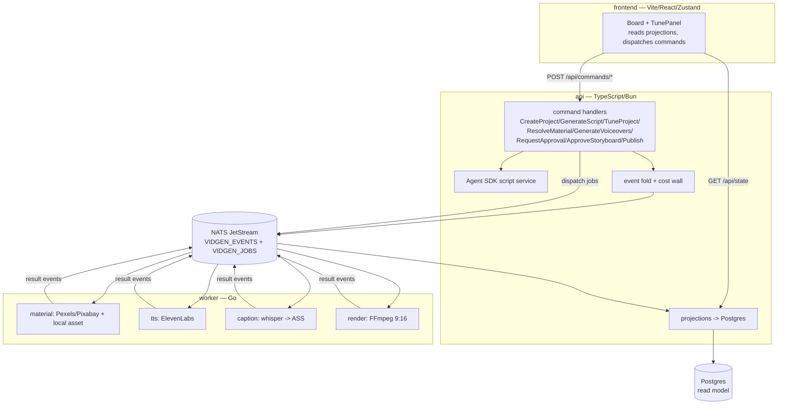

# Docs Refresh + Release Automation Implementation Plan

> **For agentic workers:** REQUIRED SUB-SKILL: Use superpowers:subagent-driven-development (recommended) or superpowers:executing-plans to implement this plan task-by-task. Steps use checkbox (`- [ ]`) syntax for tracking.

**Goal:** Rewrite the README with status badges, add an MIT LICENSE, sync CLAUDE.md, and wire up release-please for automated single-root versioning.

**Architecture:** Documentation + CI config only — no changes to api/worker/frontend source or to frozen C3 architecture facts. release-please runs single-root (`release-type: simple`): one version, one `vX.Y.Z` tag, one `CHANGELOG.md`, driven by the Conventional Commits already in the history.

**Tech Stack:** Markdown, MIT license text, shields.io badges, `googleapis/release-please-action@v4` (config-file + manifest-file mode), GitHub Actions.

## Global Constraints

- Repo slug (verbatim, all badge + workflow URLs): `cuongtranba/video-generation-skill`
- Work in git worktree `.worktrees/docs-release-automation` on branch `docs/readme-release-automation`. Never commit to `main`.
- Seed release version: `1.0.0` → first tag `v1.0.0`.
- Conventional Commit messages for every commit (release-please parses them): `feat:`, `fix:`, `docs:`, `ci:`, `chore:`.
- README accuracy — do NOT regress these facts (from CLAUDE.md gotchas):
  - ElevenLabs is the **only** TTS provider; `voice`/`speed` are **read-only labels**, not pickers.
  - Cost wall: `Σ VoiceSynthesized.ttsUsd ≤ COST_CAP_USD` (default `$0.15`) — never weaken.
  - `ApproveStoryboard` returns `400` until every scene has voiceover + material and captions are built.
  - `dispatchJob` does no key remapping (api payload keys == worker json tags).
- Exact command names (`POST /api/commands/<Name>`): `CreateProject`, `GenerateScript`, `TuneProject`, `ResolveMaterial`, `GenerateVoiceovers`, `RequestApproval`, `ApproveStoryboard`, `Publish`.
- Exact `VidgenEvent` union: `ProjectCreated`, `ScriptGenerated`, `StyleSet`, `MaterialResolved`, `VoiceSynthesized`, `CaptionsBuilt`, `CostProjected`, `AwaitingApproval`, `ApprovalGranted`, `RenderCompleted`, `Published`, `RunFailed`.
- YAML/JSON validation uses Bun (already a project dep): `bun -e '...'` with `Bun.YAML.parse` / `JSON.parse`.

---

### Task 1: MIT LICENSE

**Files:**
- Create: `LICENSE`

**Interfaces:**
- Produces: an MIT `LICENSE` file at repo root so the shields.io license badge (Task 3) resolves to "MIT".

- [ ] **Step 1: Write the LICENSE file**

Create `LICENSE` with exactly:

```text
MIT License

Copyright (c) 2026 cuong.tran

Permission is hereby granted, free of charge, to any person obtaining a copy
of this software and associated documentation files (the "Software"), to deal
in the Software without restriction, including without limitation the rights
to use, copy, modify, merge, publish, distribute, sublicense, and/or sell
copies of the Software, and to permit persons to whom the Software is
furnished to do so, subject to the following conditions:

The above copyright notice and this permission notice shall be included in all
copies or substantial portions of the Software.

THE SOFTWARE IS PROVIDED "AS IS", WITHOUT WARRANTY OF ANY KIND, EXPRESS OR
IMPLIED, INCLUDING BUT NOT LIMITED TO THE WARRANTIES OF MERCHANTABILITY,
FITNESS FOR A PARTICULAR PURPOSE AND NONINFRINGEMENT. IN NO EVENT SHALL THE
AUTHORS OR COPYRIGHT HOLDERS BE LIABLE FOR ANY CLAIM, DAMAGES OR OTHER
LIABILITY, WHETHER IN AN ACTION OF CONTRACT, TORT OR OTHERWISE, ARISING FROM,
OUT OF OR IN CONNECTION WITH THE SOFTWARE OR THE USE OR OTHER DEALINGS IN THE
SOFTWARE.
```

- [ ] **Step 2: Verify GitHub will detect it as MIT**

Run: `head -1 LICENSE`
Expected: `MIT License` (GitHub's licensee classifier keys on the standard text — the badge will read "MIT").

- [ ] **Step 3: Commit**

```bash
git add LICENSE
git commit -m "docs: add MIT license"
```

---

### Task 2: release-please automation

**Files:**
- Create: `release-please-config.json`
- Create: `.release-please-manifest.json`
- Create: `.github/workflows/release-please.yml`

**Interfaces:**
- Consumes: nothing from other tasks.
- Produces: the `test.yml` sibling workflow that opens/updates a Release PR and, on merge, cuts tag `vX.Y.Z` + a GitHub Release. Task 3's release badge reads `github/v/release`.

- [ ] **Step 1: Write the release-please config**

Create `release-please-config.json`:

```json
{
  "$schema": "https://raw.githubusercontent.com/googleapis/release-please/main/schemas/config.json",
  "packages": {
    ".": {
      "release-type": "simple",
      "changelog-path": "CHANGELOG.md",
      "include-component-in-tag": false,
      "bump-minor-pre-major": false
    }
  }
}
```

- [ ] **Step 2: Write the manifest (seed version)**

Create `.release-please-manifest.json`:

```json
{
  ".": "1.0.0"
}
```

- [ ] **Step 3: Write the workflow**

Create `.github/workflows/release-please.yml` (v4 usage verified against Context7 `googleapis/release-please-action`):

```yaml
name: release-please

on:
  push:
    branches:
      - main

permissions:
  contents: write
  pull-requests: write

jobs:
  release-please:
    runs-on: ubuntu-latest
    steps:
      - uses: googleapis/release-please-action@v4
        with:
          token: ${{ secrets.GITHUB_TOKEN }}
          config-file: release-please-config.json
          manifest-file: .release-please-manifest.json
```

- [ ] **Step 4: Validate the JSON and YAML parse**

Run:
```bash
bun -e 'JSON.parse(await Bun.file("release-please-config.json").text()); JSON.parse(await Bun.file(".release-please-manifest.json").text()); Bun.YAML.parse(await Bun.file(".github/workflows/release-please.yml").text()); console.log("OK")'
```
Expected: `OK` (no parse exception).

- [ ] **Step 5: Verify the manifest version matches api**

Run: `grep '"version"' api/package.json`
Expected: `"version": "1.0.0",` — must equal the manifest's `1.0.0` seed so the first Release PR is a no-op-to-`v1.0.0` (or the next `feat`/`fix` bumps from a correct base).

- [ ] **Step 6: Commit**

```bash
git add release-please-config.json .release-please-manifest.json .github/workflows/release-please.yml
git commit -m "ci: add release-please for automated single-root versioning"
```

---

### Task 3: README full rewrite (with badges)

**Files:**
- Modify (overwrite): `README.md`

**Interfaces:**
- Consumes: `LICENSE` (Task 1) for the license badge; `release-please.yml` (Task 2) for the release badge; `test.yml` (existing) for the CI badge.
- Produces: the canonical project README. CLAUDE.md (Task 4) is reconciled against it.

- [ ] **Step 1: Overwrite `README.md` with the full rewrite**

Write `README.md` with exactly this content:

````markdown
# vidgen

[](https://github.com/cuongtranba/video-generation-skill/actions/workflows/test.yml)
[](https://github.com/cuongtranba/video-generation-skill/releases)
[](./LICENSE)
[](https://bun.sh)
[](https://go.dev)
[](https://react.dev)
[](https://nats.io)
[](https://www.postgresql.org)

Event-sourced webapp that turns an idea into a ready-to-post short-form vertical video (9:16, 15–90s) with **Vietnamese voiceover**, karaoke captions, stock footage, local uploads, and background music — end to end, in the browser.

```
"3 lý do bạn nên uống nước ấm mỗi sáng"
        │
        ▼
   21s MP4 · 1080x1920 · giọng ElevenLabs · phụ đề karaoke · nhạc nền
   cost: $0.0036 (cap $0.15)
```

## Architecture

Three services over NATS JetStream + Postgres. The **api** owns the event store, command handlers, and read-model projections; the **worker** runs the media pipeline as idempotent job consumers; the **frontend** is a live event board. Frozen architecture facts live in `.c3/` (see the [C3 skill](#project-layout)).



**Event-sourced flow.** Commands append to `VIDGEN_EVENTS` and dispatch jobs to `VIDGEN_JOBS`. Workers consume jobs and emit result events (`MaterialResolved`, `VoiceSynthesized`, `CaptionsBuilt`, `RenderCompleted`, `RunFailed`). The api folds events into `ProjectState` and projects them into Postgres for the read model (`GET /api/state`). `dispatchJob` does no key remapping — api payload keys equal the worker's JSON tags.

**Cost wall.** `Σ VoiceSynthesized.ttsUsd ≤ COST_CAP_USD` (default `$0.15`, set in compose). Projected at `GenerateVoiceovers` (`CostProjected`) and enforced before spend.

### Components

Three containers, 27 components (ids from the C3 model in `.c3/`).

**`api` — TypeScript/Bun event-sourced command surface**

| Component | Responsibility |
|---|---|
| `events` | Frozen `VidgenEvent` union + `foldProject` → `ProjectState` |
| `aggregate` | Command-transition guards (project exists, legal transition) |
| `commands` | Command handlers + dispatcher |
| `nats` | `EventStore` (VIDGEN_EVENTS), job publisher (VIDGEN_JOBS), projection consumer wiring |
| `projections` | Postgres read model, durable consumer |
| `cost` | TTS budget estimator + enforced cost wall |
| `script` | Agent SDK scene generator (idea → scenes) |
| `http` | HTTP command surface + static SPA/media server |
| `db` | Thin typed Postgres connection wrapper |

**`worker` — Go idempotent job consumers**

| Component | Responsibility |
|---|---|
| `jobhandler` | material / tts / caption / render handler types |
| `eventstore` | Worker-side result event structs + publisher |
| `tts` | ElevenLabs TTS provider behind a factory |
| `material` | Stock visual sourcing (Pexels / Pixabay) + download |
| `music` | Jamendo background-music search + download |
| `render` | FFmpeg filtergraph 9:16 MP4 composer |
| `caption` | Whisper transcription → ASS karaoke captions |
| `config` | Provider selection + secret loading from `config.yaml`/`.env` |
| `prereq` | External binary resolver (ffmpeg, ffprobe, whisper) |
| `domain` | Shared domain value types (Voice, Speed, CaptionStyle) |

**`frontend` — Vite/React/Zustand live event board**

| Component | Responsibility |
|---|---|
| `store` | Zustand store + `VidgenEvent` mirror of the api catalogue |
| `natsClient` | NATS WebSocket subscription to VIDGEN_EVENTS |
| `Board` | Live project list view |
| `ProjectCard` | Per-project status card |
| `TunePanel` | Style tuning + storyboard approval panel |
| `SceneStrip` | Per-scene asset (thumbnail/audio) preview |
| `StoryboardApproval` | Approval-gate widget |

## Quick start

```bash
# secrets (gitignored) — only the keys for your selected providers are required
cat > .env <<'EOF'
ELEVENLABS_API_KEY=...   # elevenlabs.io — multilingual Vietnamese TTS (required)
PEXELS_API_KEY=...       # pexels.com/api — stock video
PIXABAY_API_KEY=...      # pixabay.com/api — stock video (optional)
JAMENDO_CLIENT_ID=...    # devportal.jamendo.com — music search
EOF

# Agent SDK auth for script generation (no API key needed — the SDK bundles its
# runtime; a Claude subscription OAuth token works). One of:
export CLAUDE_CODE_OAUTH_TOKEN=...   # from `claude setup-token`
#   or  export ANTHROPIC_API_KEY=...

docker compose up --build
```

Drive the pipeline from the browser SPA, or hit the HTTP command API directly:

```bash
API=http://localhost:8080
PID=$(curl -s -X POST $API/api/commands/CreateProject -H 'content-type: application/json' \
  -d '{"idea":"a calico cat learns to surf","durationSec":16,"sceneCount":2,"tone":"playful","idempotencyKey":"1"}' \
  | sed -E 's/.*"projectId":"([^"]+)".*/\1/')

curl -s -X POST $API/api/commands/GenerateScript     -d "{\"projectId\":\"$PID\",\"idempotencyKey\":\"2\"}" -H 'content-type: application/json'
curl -s -X POST $API/api/commands/TuneProject        -d "{\"projectId\":\"$PID\",\"captionStyle\":{\"fontName\":\"Arial\",\"fontSize\":48},\"idempotencyKey\":\"3\"}" -H 'content-type: application/json'
curl -s -X POST $API/api/projects/$PID/assets        -F file=@./my-clip.jpg      # optional local upload (used as scene media, in order)
curl -s -X POST $API/api/commands/ResolveMaterial    -d "{\"projectId\":\"$PID\",\"idempotencyKey\":\"4\"}" -H 'content-type: application/json'
curl -s -X POST $API/api/commands/GenerateVoiceovers -d "{\"projectId\":\"$PID\",\"idempotencyKey\":\"5\"}" -H 'content-type: application/json'
# wait for voiceovers + whisper captions to finish (GET /api/state shows scene mp3/ass), then:
curl -s -X POST $API/api/commands/RequestApproval    -d "{\"projectId\":\"$PID\",\"idempotencyKey\":\"6\"}" -H 'content-type: application/json'
curl -s -X POST $API/api/commands/ApproveStoryboard  -d "{\"projectId\":\"$PID\",\"idempotencyKey\":\"7\"}" -H 'content-type: application/json'
# render output.mp4 lands on the shared media volume; status -> rendered
```

> **Approval is gated:** `ApproveStoryboard` returns `400` until every scene has its voiceover + resolved material and captions are built. Approve only once processing finishes (whisper transcription takes a couple of minutes).

## Command API

All commands are `POST /api/commands/<Name>` with a JSON body carrying `projectId` (except `CreateProject`) and an `idempotencyKey` (replays return the cached result).

| Command | Body (beyond `idempotencyKey`) | Effect |
|---|---|---|
| `CreateProject` | `idea`, `durationSec`, `sceneCount`, `tone` | Emit `ProjectCreated`; returns `projectId` |
| `GenerateScript` | `projectId` | Agent SDK writes scenes → `ScriptGenerated` |
| `TuneProject` | `projectId`, `captionStyle?`, `music?` | Last-write-wins `StyleSet` (see [Tune](#tune)) |
| `ResolveMaterial` | `projectId` | Dispatch material jobs (local uploads first, else stock) → `MaterialResolved` |
| `GenerateVoiceovers` | `projectId` | Project cost (`CostProjected`), enforce cap, dispatch TTS → `VoiceSynthesized` |
| `RequestApproval` | `projectId` | `AwaitingApproval` once inputs are pending |
| `ApproveStoryboard` | `projectId` | `400` until inputs ready; else `ApprovalGranted` → render → `RenderCompleted` |
| `Publish` | `projectId` | `Published` (publish provider is `none` by default) |

Other routes:

| Route | Purpose |
|---|---|
| `GET /api/state` | Full read model (all projects + scenes) |
| `GET /api/config` | `{ ttsProvider }` — the SPA uses it to render the fixed-voice label |
| `POST /api/projects/:id/assets` | Multipart upload (`.mp4/.mov/.jpg/.jpeg/.png`), assigned to scenes in upload order |
| `GET /api/projects/:id/assets` | List uploaded assets |
| `GET /api/projects/:id` | Single project read model |
| `GET /media/*` | Rendered output + intermediate media from the shared volume |

## Event catalogue

The `VidgenEvent` union is frozen in `api/src/events.ts`, mirrored verbatim in `frontend/src/store/events.ts`, and matched by the worker structs in `worker/internal/eventstore/events.go`.

| Event | Emitted by | Meaning |
|---|---|---|
| `ProjectCreated` | `CreateProject` | New project + idea/duration/scene params |
| `ScriptGenerated` | `GenerateScript` | Scenes (narration + visual prompts); `scriptUsd` |
| `StyleSet` | `TuneProject` | Caption style / music (last-write-wins) |
| `MaterialResolved` | worker material | Scene `assetPath` (stock or upload), `isImage` |
| `VoiceSynthesized` | worker tts | Scene mp3 + `durationSec` + `ttsUsd` |
| `CaptionsBuilt` | worker caption | Whisper ASS captions ready (`captionsReady`) |
| `CostProjected` | `GenerateVoiceovers` | Projected TTS spend vs. `COST_CAP_USD` |
| `AwaitingApproval` | `RequestApproval` | Storyboard is pending human approval |
| `ApprovalGranted` | `ApproveStoryboard` | Inputs complete; render dispatched |
| `RenderCompleted` | worker render | `output.mp4` on the media volume |
| `Published` | `Publish` | Publish step recorded |
| `RunFailed` | any worker | A job failed (carries the failing step/error) |

## Tune

`TuneProject` records a `StyleSet` event (last-write-wins) folded into `ProjectState.style`, allowed any time before approval:

| Field | Meaning |
|---|---|
| `voice` | *(not adjustable)* — ElevenLabs uses a fixed multilingual voice ID; the SPA shows a read-only "ElevenLabs (fixed)" label instead of a picker |
| `speed` | *(not adjustable)* — ElevenLabs has no speed control in this integration |
| `captionStyle` | `{ fontName, fontSize }` |
| `music` | `{ search, volume }` (Jamendo mood search) or `null` |

Local uploads (`POST /api/projects/:id/assets`, `.mp4/.mov/.jpg/.jpeg/.png`) are assigned to scenes in upload order; scenes without an upload fall back to stock.

## Providers

Selected per-category in `config.yaml` (mounted into the worker **and** the api via `CONFIG_PATH`). Keys stay in `.env`; only selected providers' keys are required and are validated by `config.ValidateForProviders`. The api reads `tts.provider` from `config.yaml` and exposes it at `GET /api/config` → `{ ttsProvider }`.

```yaml
tts:
  provider: elevenlabs   # only supported TTS provider
material:
  providers: [pexels]    # pexels | pixabay
music:
  provider: jamendo      # jamendo | none
videogen: { provider: none }
publish:  { provider: none }
```

| Category | Providers |
|---|---|
| `tts` | ElevenLabs (`eleven_turbo_v2_5` for Vietnamese, fixed voice ID; override with `ELEVENLABS_VOICE_ID` / `ELEVENLABS_MODEL_ID`) |
| `material` | Pexels, Pixabay, local uploads |
| `music` | Jamendo |

## Project layout

```
.
├── api/            TypeScript/Bun — event store, commands, projections, cost wall, HTTP (bun test)
├── worker/         Go — idempotent job handlers: material, tts, caption, render (go test ./...)
├── frontend/       Vite/React/Zustand — live event board SPA (bun test)
├── rules/          ast-grep rules + rule-tests (bun run test:sg / lint:sg)
├── .c3/            frozen C3 architecture facts (managed by the C3 skill — do not hand-edit)
├── .github/workflows/  test.yml (CI) + release-please.yml
├── config.yaml     provider selection (mounted into api + worker)
└── docker-compose.yml
```

## Development

```bash
# api (TypeScript/Bun)
cd api && bun test          # unit tests (never *.integration.test.ts — needs live NATS+Postgres)
cd api && bun run typecheck

# worker (Go)
cd worker && go build ./...
cd worker && go test ./internal/jobhandler/... ./internal/render/...   # targeted
cd worker && go vet ./...

# frontend (Vite/React)
cd frontend && bun test
cd frontend && bun run lint        # oxlint
cd frontend && bun run typecheck

# ast-grep gates (repo root)
bun install                 # once — installs @ast-grep/cli
bun run test:sg             # rule self-tests
bun run lint:sg             # scan: useState ban (frontend), interface{}/any ban (worker)
```

CI (`.github/workflows/test.yml`) runs four jobs on push/PR to `main`: **ast-grep** (rule tests + scan), **api** (typecheck + `bun test`, integration suites self-skip without NATS/Postgres), **worker** (`go build`/`vet`/`test ./...`), **frontend** (oxlint, typecheck, `bun test`, vite build). External binaries in the worker image: ffmpeg (with libass), whisper.

## Release process

Versioning is automated by [release-please](https://github.com/googleapis/release-please) (single root release: one version, one `vX.Y.Z` tag, one `CHANGELOG.md`).

1. Land changes on `main` with [Conventional Commit](https://www.conventionalcommits.org) messages (`feat:`, `fix:`, `docs:`, `ci:`, `chore:`).
2. `.github/workflows/release-please.yml` opens or updates a **Release PR** that bumps the version and rolls the changelog.
3. Merge the Release PR → release-please tags `vX.Y.Z` and publishes a GitHub Release. The release badge updates automatically.

`feat:` → minor, `fix:` → patch, `feat!:`/`BREAKING CHANGE:` → major.

## License

[MIT](./LICENSE) © 2026 cuong.tran

## Attribution

- Stock footage: [Pexels](https://pexels.com) / [Pixabay](https://pixabay.com)
- Music: [Jamendo](https://jamendo.com)
````

- [ ] **Step 2: Verify the mermaid block is balanced and badges/links are well-formed**

Run:
```bash
grep -c '```mermaid' README.md; grep -c '^```$' README.md; grep -c 'img.shields.io' README.md
```
Expected: `1` mermaid fence; an even count of bare ` ``` ` closers; `8` shields badges.

- [ ] **Step 3: Verify no accuracy regressions (constraint scan)**

Run:
```bash
grep -q 'only supported TTS provider' README.md && grep -q 'COST_CAP_USD' README.md && grep -q 'returns .400.' README.md && grep -q 'read-only' README.md && echo "CONSTRAINTS OK"
```
Expected: `CONSTRAINTS OK`.

- [ ] **Step 4: Commit**

```bash
git add README.md
git commit -m "docs: rewrite README with badges, component inventory, command/event reference, release process"
```

---

### Task 4: Sync CLAUDE.md

**Files:**
- Modify: `CLAUDE.md`

**Interfaces:**
- Consumes: the rewritten README (Task 3) and the release workflow (Task 2) for consistent wording.
- Produces: project guide reconciled with the README + a release note. No frozen C3 fact changes.

- [ ] **Step 1: Add a Release subsection under the Commands section**

In `CLAUDE.md`, immediately after the closing ``` of the Commands code block (the line with `docker compose up --build`), insert:

```markdown

**Release.** Versioning is automated by release-please (single root: `release-type: simple`, config `release-please-config.json` + `.release-please-manifest.json`, workflow `.github/workflows/release-please.yml`). Land Conventional Commits on `main`; a Release PR bumps the version + `CHANGELOG.md`; merging it tags `vX.Y.Z` + a GitHub Release. `feat:` → minor, `fix:` → patch, `feat!:`/`BREAKING CHANGE:` → major.
```

- [ ] **Step 2: Note license + badges in the intro line**

Change the first content line of `CLAUDE.md` from:

```markdown
# vidgen — Claude Code project guide
```

to:

```markdown
# vidgen — Claude Code project guide

MIT-licensed. README carries CI, release, license, and tech-stack badges; keep them and the README's command/event tables in sync when the HTTP surface or event catalogue changes.
```

- [ ] **Step 3: Verify the two insertions landed and nothing else changed**

Run:
```bash
grep -q 'release-please (single root' CLAUDE.md && grep -q 'MIT-licensed' CLAUDE.md && echo "CLAUDE.md OK"
git diff --stat CLAUDE.md
```
Expected: `CLAUDE.md OK`; the diff touches only `CLAUDE.md` with a small insertion count.

- [ ] **Step 4: Commit**

```bash
git add CLAUDE.md
git commit -m "docs: sync CLAUDE.md with README rewrite + release-please note"
```

---

### Task 5: Land the branch

**Files:** none (integration).

- [ ] **Step 1: Final verification sweep**

Run:
```bash
bun -e 'JSON.parse(await Bun.file("release-please-config.json").text()); JSON.parse(await Bun.file(".release-please-manifest.json").text()); Bun.YAML.parse(await Bun.file(".github/workflows/release-please.yml").text()); Bun.YAML.parse(await Bun.file(".github/workflows/test.yml").text()); console.log("workflows+config OK")'
test -f LICENSE && head -1 LICENSE
git status --short
git log --oneline -6
```
Expected: `workflows+config OK`; `MIT License`; a clean working tree; five Conventional-Commit messages on the branch.

- [ ] **Step 2: Push and open the PR**

```bash
git push -u origin docs/readme-release-automation
gh pr create --base main --title "docs: README rewrite + badges, MIT license, release-please automation" \
  --body "$(cat <<'EOF'
## Summary
- Full README rewrite: status badges, C3 component inventory, command API + event catalogue reference, project layout, release process.
- Add MIT LICENSE.
- Add release-please (single root, `release-type: simple`): config + manifest + workflow.
- Sync CLAUDE.md with the README and add a release-process note.

Docs + CI config only — no api/worker/frontend source changes, no frozen C3 fact changes.

## Test plan
- `release-please-config.json`, `.release-please-manifest.json`, both workflows parse (Bun JSON/YAML).
- README: single mermaid fence, 8 badges, accuracy-constraint scan passes.
- Manifest seed `1.0.0` matches `api/package.json`.
EOF
)"
```

- [ ] **Step 3: Report the PR URL to the user** and note that merging the release-please Release PR (created after this lands) will cut `v1.0.0`.

---

## Self-Review

**Spec coverage:**
- README full rewrite → Task 3 ✓ (badges, architecture+component table, quick start, command API, event catalogue, tune, providers, project layout, development, release process, license, attribution — every spec §2 section present).
- CLAUDE.md sync → Task 4 ✓ (release subsection + license/badge note).
- CI badges → Task 3 Step 1 ✓ (CI, release, license, Bun, Go, React, NATS, Postgres = 8).
- release-please → Task 2 ✓ (config + manifest + workflow, verified against Context7).
- LICENSE MIT → Task 1 ✓.
- Seed version 1.0.0 → Task 2 Steps 2, 5 ✓.
- Worktree + PR workflow → Task 5 ✓.

**Placeholder scan:** No TBD/TODO; all file contents are literal; every verification has an exact command + expected output.

**Type/name consistency:** Command names, event names, and route paths in the README tables match the Global Constraints (extracted from `api/src/http.ts` + `api/src/events.ts`). Badge repo slug is identical across all URLs. Manifest path `.` matches config package key `.`.
