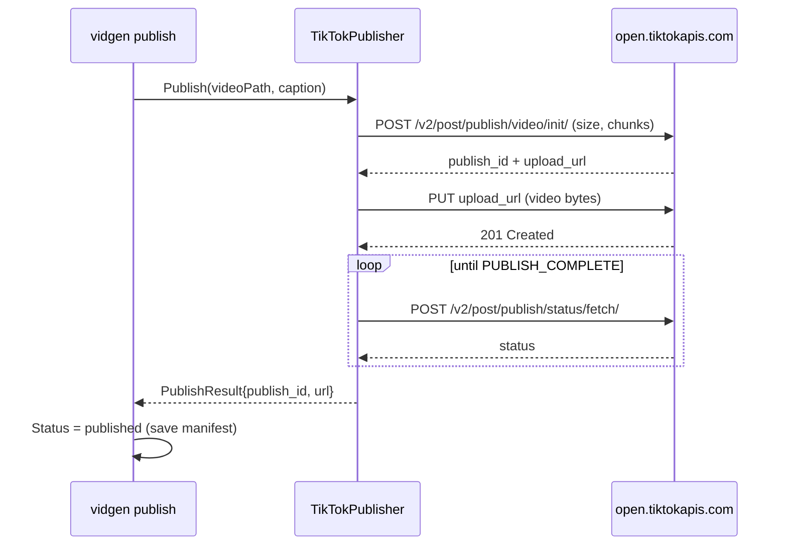

# Provider Adapters + YAML Config — Design

**Date:** 2026-07-09
**Status:** Approved, pre-implementation

## Goal

Make every external provider in the pipeline pluggable, selected by a YAML config
file, so we can swap voice (FPT / ElevenLabs), music (Jamendo), stock material
(Pexels / Pixabay / TikTok), AI clip generation (videogen), and publishing
(TikTok) without touching wiring code. API keys stay in `.env` / env vars — YAML
never holds secrets.

## Non-Goals

- No new paid provider is implemented and verified end-to-end in this change,
  except TikTok publish (real impl, unit-tested with `httptest`; live verify is
  the user's, needs a real OAuth token).
- No AI clip-generation provider is implemented — interface + config seam only.
- No TikTok *pull* (material download) implementation — no compliant public API
  exists; name is selectable but returns "not implemented".
- No plugin/registry system. In-tree providers only.

## Constraints

- Uber Go style: DI via constructors, **no package-level mutable state**,
  compile-time interface checks (`var _ I = (*T)(nil)`), wrap every error.
- No `any`/`interface{}` for data — concrete typed config structs, no untyped maps.
- Missing config file → current behavior exactly (zero breaking change).
- Cost wall untouched (`internal/cost` $0.10/video stays).
- Table-driven tests; external APIs mocked with `httptest`; all tests offline.

## Approach — Factory Per Category

Each category package exposes `NewFromConfig(catCfg, keys) (Interface, error)`
that switches on the provider name from YAML. No central registry (that would
need package-level mutable state, banned by convention). Adding a provider =
extend one switch — acceptable, providers are added rarely and in-tree.

Rejected: (B) self-registering registry via `init()` — violates no-global-state
rule. (C) inline switch in `root.go` — untestable, grows the wiring file.

## Config File

Location: `~/.vidgen/config.yaml`. Override with `--config <path>` persistent
flag. Absent file → all defaults below (= today's hardcoded wiring).

```yaml
tts:
  provider: fpt          # fpt | elevenlabs (future)
  voice: banmai
  speed: 0
music:
  provider: jamendo      # jamendo | none
material:
  providers: [pexels, pixabay]   # ordered fallback chain; pexels | pixabay | tiktok(seam)
videogen:
  provider: none         # none | runway | kling (future)
publish:
  provider: none         # none | tiktok
```

Parsed with `gopkg.in/yaml.v3` into concrete typed structs (no maps):

```go
type ProvidersConfig struct {
    TTS      TTSSelect      `yaml:"tts"`
    Music    MusicSelect    `yaml:"music"`
    Material MaterialSelect `yaml:"material"`
    VideoGen VideoGenSelect `yaml:"videogen"`
    Publish  PublishSelect  `yaml:"publish"`
}
type TTSSelect      struct { Provider string `yaml:"provider"`; Voice string `yaml:"voice"`; Speed int `yaml:"speed"` }
type MusicSelect    struct { Provider string `yaml:"provider"` }
type MaterialSelect struct { Providers []string `yaml:"providers"` }
type VideoGenSelect struct { Provider string `yaml:"provider"` }
type PublishSelect  struct { Provider string `yaml:"provider"` }
```

`DefaultProvidersConfig()` returns the values shown above. `LoadProviders(path)`
merges: absent file → defaults; present → unmarshal, then fill any empty field
from defaults. Unknown provider names are **not** rejected at load time — the
factory rejects them with a message listing valid names (keeps parse pure).

## Categories

| Category | Interface | Package | Real now | Seam (selectable, "not implemented yet") |
|---|---|---|---|---|
| tts | `TTSProvider` (exists) | `internal/tts` | FPT | `elevenlabs` |
| music | `MusicSource` (exists) | `internal/music` | Jamendo, `none` (no-op) | — |
| material | `MaterialSource` (exists) | `internal/material` | Pexels, Pixabay | `tiktok` (pull — no public API) |
| videogen | `ClipGenerator` (**new**) | `internal/videogen` | — | `runway`, `kling` |
| publish | `Publisher` (**new**) | `internal/publish` | **TikTok** | `youtube`, `instagram` |

### New interfaces

```go
// internal/videogen — seam only, no impl wired into flow this change.
type ClipRequest struct {
    Prompt      string
    DurationSec float64
    Width, Height int
}
type ClipResult struct { ClipPath string; DurationSec float64 }
type ClipGenerator interface {
    Generate(ctx context.Context, req ClipRequest, destPath string) (ClipResult, error)
}

// internal/publish
type PublishRequest struct {
    VideoPath string
    Caption   string
    Privacy   string // e.g. "public" | "private"
}
type PublishResult struct { PublishID string; URL string }
type Publisher interface {
    Publish(ctx context.Context, req PublishRequest) (PublishResult, error)
}
```

### music `none`

`none` returns a no-op `MusicSource` whose `Search` yields zero tracks and
`Download` is never reached — flow already tolerates empty music (background
music optional). Avoids forcing a Jamendo key when music is off.

## Publish Flow

- New package `internal/publish` with `Publisher` interface + `TikTokPublisher`.
- New CLI command `vidgen publish --project <id>`: loads a project, requires
  `Status == rendered`, uploads `OutputPath`, sets `Status = published`.
- New status `domain.StatusPublished` ("published") after `rendered`. Resumable:
  re-running publish on an already-published project is a no-op (idempotent, per
  worker convention) unless `--force`.
- **TikTok Content Posting API** (`open.tiktokapis.com`): OAuth access token from
  env `TIKTOK_ACCESS_TOKEN`. Flow: `POST /v2/post/publish/video/init/` (declare
  size + chunk) → `PUT` file bytes to returned `upload_url` → poll
  `POST /v2/post/publish/status/fetch/` until `PUBLISH_COMPLETE` or failure.
- Verify Context7 docs for the current TikTok endpoint shapes before coding.
- Unit-tested with `httptest` (init → upload → status happy path + failure).
  Live verify (real token) is the user's.

## Wiring Changes

`internal/cli/root.go`:
- Add `--config` persistent flag (default `~/.vidgen/config.yaml`).
- In `init`: `providers, _ := config.LoadProviders(cfgPath)`.
- Replace hardcoded constructors with factories:
  - `tts.NewFromConfig(providers.TTS, cfg)`
  - `music.NewFromConfig(providers.Music, cfg)`
  - `material.NewFromConfig(providers.Material, cfg)` (builds `Chain`)
- Add `publishCmd` wired to `publish.NewFromConfig(providers.Publish, keys)`.

`config.ValidateForGenerate`: require only keys for *selected* providers
(e.g. material list drives which of Pexels/Pixabay keys are mandatory; music
`none` needs no Jamendo key).

## Error Handling

- Malformed YAML → fail at startup, error carries file path (and line if yaml.v3
  provides it).
- Unknown provider name → factory error listing supported names for that category.
- Selected provider missing its key → `ValidateForGenerate` names the missing env var.
- Publish on non-`rendered` project → clear error stating current status.

## Testing

- `config`: table-driven — defaults on absent file, unknown provider passes parse,
  malformed YAML errors, partial file fills from defaults.
- `tts` / `music` / `material` / `publish` factories: table-driven name→type,
  unknown name → error.
- `material` chain: ordered fallback preserved from `providers` list.
- `publish/tiktok`: `httptest` server — init/upload/status happy path + API failure.
- All offline, no real API calls, no cost.

## Verification

- `go build`, `go test ./...`, `go vet ./...` green.
- `./vidgen generate` on an existing project with **no** config file → identical
  behavior, $0 (idempotent TTS).
- TikTok publish live-verified by user with a real `TIKTOK_ACCESS_TOKEN`.

## Architecture Diagram

```mermaid
graph TD
    subgraph CFG["Config layer"]
        YAML["~/.vidgen/config.yaml<br/>(provider selection)"]
        ENV[".env / env vars<br/>(API keys, secrets)"]
        PC["config.ProvidersConfig<br/>(typed structs)"]
        YAML -->|LoadProviders| PC
        ENV -->|config.Load| KEYS["config.Config (keys)"]
    end

    subgraph ROOT["internal/cli/root.go — wiring"]
        INIT["app.init(--config)"]
    end
    PC --> INIT
    KEYS --> INIT

    subgraph FAC["Factories (NewFromConfig per category)"]
        FTTS["tts.NewFromConfig"]
        FMUS["music.NewFromConfig"]
        FMAT["material.NewFromConfig"]
        FPUB["publish.NewFromConfig"]
    end
    INIT --> FTTS & FMUS & FMAT & FPUB

    subgraph IMPL["Provider implementations"]
        direction LR
        FTTS -->|fpt| FPT["FPTAIProvider ✅"]
        FTTS -.->|elevenlabs| EL["ElevenLabs (seam)"]
        FMUS -->|jamendo| JAM["JamendoSource ✅"]
        FMUS -->|none| NOOP["no-op music ✅"]
        FMAT -->|pexels/pixabay| STK["Pexels/Pixabay Chain ✅"]
        FMAT -.->|tiktok| TKM["TikTok pull (seam)"]
        FPUB -->|tiktok| TKP["TikTokPublisher ✅"]
        FPUB -.->|youtube/instagram| PS["(seam)"]
    end

    subgraph VG["videogen (interface + config seam only)"]
        CG["ClipGenerator iface"]
    end
    PC -.videogen.provider=none.-> CG

    subgraph FLOW["Pipeline"]
        GEN["generate: draft→material→tuned→confirmed→rendered"]
        PUBS["publish cmd: rendered→published"]
    end
    FPT & JAM & NOOP & STK --> GEN
    GEN -->|OutputPath .mp4| PUBS
    TKP --> PUBS

    classDef done fill:#1b5e20,stroke:#66bb6a,color:#fff
    classDef seam fill:#4a3b00,stroke:#ffca28,color:#fff,stroke-dasharray: 4 3
    class FPT,JAM,NOOP,STK,TKP done
    class EL,TKM,PS,CG seam
```

### Publish sequence (TikTok)


