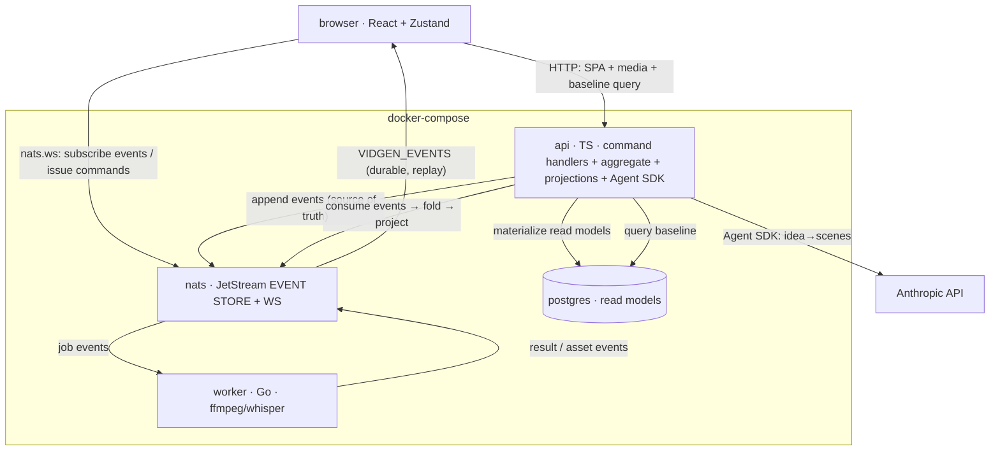
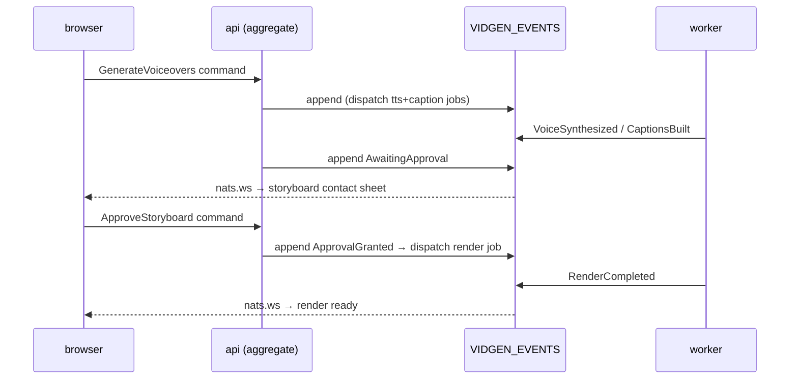

# vidgen → webapp rewrite: NATS event-store architecture + delivery OKR loop

**Status:** design — awaiting user review
**Date:** 2026-07-09
**Branch:** `feat/webapp-rewrite`

---

## 1. The pivot (locked decisions)

vidgen changes from a **Go CLI** into a **multi-service webapp**. Decisions taken during brainstorming:

| # | Decision | Choice |
|---|---|---|
| 1 | Surface | Embedded web board → full webapp |
| 2 | Event backbone | **NATS**, everything flows through it |
| 3 | NATS role | **Event store** (event sourcing), not just transport |
| 4 | Scope | Live board + replay + **storyboard approval gate** |
| 5 | Approval gate | Resumable stop → api state transition (event) |
| 6 | CLI | **Fully removed** |
| 7 | Script generation | **Claude Agent SDK** (TS) — replaces `claude` CLI |
| 8 | Read-model store | **Postgres** (projection, not source of truth) |
| 9 | Migration | **Big-bang** |
| 10 | Backend | **TypeScript** api + orchestration; **Go worker** kept for media |
| 11 | Frontend | Vite + React + TS + **Zustand** (all state/logic in store, lint-enforced) |
| 12 | Client transport | **nats.ws** (browser talks NATS directly over WebSocket) |
| 13 | Deployment | **docker-compose**, services separated |

---

## 2. Target architecture — event sourcing / CQRS with a NATS event store

### 2.1 Services

| Service | Lang | Role |
|---|---|---|
| `nats` | — | JetStream (file volume) **event store** + WebSocket listener; TCP 4222 for services |
| `postgres` | — | **read-model** projections (queryable views); rebuildable from the event log |
| `api` | TypeScript/Node | command handlers, Project aggregate, Claude Agent SDK script gen, cost-wall admissibility, projections, serves SPA + media |
| `worker` | Go (kept) | consumes job events, runs ffmpeg+libass / whisper (tts/material/caption/render), emits result/asset events |
| `frontend` | Vite/React/TS/Zustand | SPA; `vite dev` in dev, served by api in prod |

### 2.2 Topology

### 2.3 Event store design

- **Stream `VIDGEN_EVENTS`** — append-only, file-backed, the single source of truth.
  - Subject: `vidgen.evt.<projectID>.<eventType>`. Per-project ordering by stream sequence.
  - Retention: limits/none (keep full history → replay + audit). Snapshotting (§2.6) bounds fold cost.
- **Stream `VIDGEN_JOBS`** — commands/jobs api → worker (`vidgen.job.<kind>.<projectID>.<scene>`), work-queue retention.
- Events are **concrete typed structs** (no `any`; mirrors `rule-no-any-data`), JSON-encoded, versioned (`v` field for schema evolution).

Event catalogue (initial):

| Event | Appended by | Payload |
|---|---|---|
| `ProjectCreated` | api | id, idea, duration, scenes, tone, style |
| `ScriptGenerated` | api (Agent SDK) | scene list (narration + visual notes), token cost |
| `MaterialResolved` | worker | scene idx, source, asset path |
| `VoiceSynthesized` | worker | scene idx, mp3 path, char count, cost |
| `CaptionsBuilt` | worker | scene idx, ass path |
| `CostProjected` | api | projected USD, cap |
| `AwaitingApproval` | api | project id, contact-sheet refs |
| `ApprovalGranted` | api (from browser command) | project id |
| `RenderCompleted` | worker | output mp4 path, actual USD |
| `Published` | api | platform, post id, url |
| `RunFailed` | api/worker | stage, error |

### 2.4 Command flow (write side)

1. Browser issues a **command** (nats.ws request or HTTP POST) — e.g. `CreateProject`, `GenerateVoiceovers`, `ApproveStoryboard`.
2. api loads the **Project aggregate** by folding its event stream (or from a snapshot + tail).
3. api validates invariants — legal status transition, **cost-wall admissibility** (project cost ≤ cap *before* dispatch; matches the three-point anti-goal admissibility check).
4. api **appends** the resulting event(s) to `VIDGEN_EVENTS`. Append is the commit. Dispatches jobs to `VIDGEN_JOBS` where media work is needed.
5. Idempotency: command carries a client-generated key; api dedupes via `Nats-Msg-Id` on the events it appends, so retries never double-append. (Mirrors `ref-idempotent-worker`, now at the event level.)

### 2.5 Projections (read side / CQRS)

- api runs durable consumers on `VIDGEN_EVENTS`, folding events into **Postgres** tables: `projects`, `scenes`, `assets`, `cost_ledger`.
- Read models serve baseline REST (`GET /api/state`, `GET /api/projects/:id`) and media metadata.
- **Postgres is disposable**: `DROP` + replay `VIDGEN_EVENTS` from seq 0 fully rebuilds it. The log is the truth.

### 2.6 Replay & snapshots

- **Replay (UI):** browser reads `VIDGEN_EVENTS` for a project from seq 0 via nats.ws, scrubs by event timestamp — native, no bespoke store.
- **Snapshots:** api periodically writes an aggregate snapshot (KV bucket keyed by projectID + last seq) so folding a long-lived project doesn't replay the whole log.

### 2.7 Approval gate as an event

### 2.8 Frontend — Zustand single-store + lint ban

- **Zustand store** owns everything: the nats.ws subscription, event-fold reducers, normalized project/scene/cost state, derived selectors, and all commands. Components are pure — read selectors, dispatch store actions, **no local state or logic**.
- **Lint ban (ESLint flat config):**
  - `no-restricted-syntax` bans `useState` / `useReducer` in `src/components/**` (and `useEffect` with side-effect bodies).
  - import boundary: `components/**` imports from `store/**` and `ui/**` only (`no-restricted-imports`).
  - `useRef` allowed for DOM nodes only.
  - CI gate: `npm run lint` must pass; a fixture component using `useState` must fail lint (test the rule).
- Library APIs (Vite / React / Zustand / ESLint flat / nats.ws) verified against **Context7** before config is written.

---

## 3. Kept / rewritten / deleted

- **Kept (→ Go `worker`):** `internal/{tts,material,caption,render}` and the bus/worker plumbing, re-pointed at the event store.
- **Rewritten (→ TS `api`):** `internal/{flow,cost,domain,config,publish}` orchestration; `internal/cli` → REST + NATS command handlers.
- **Deleted:** `cmd/vidgen`, `internal/cli` (cobra CLI). `claude` CLI script gen → Agent SDK.

---

## 4. C3 impact

This replaces the CLI-centric model wholesale, so it is **not** a small patch:
- `c3-0` system statement: "CLI" → "webapp".
- `c3-1` "vidgen CLI process" container is dissolved into new containers: `api`, `worker` (retains c3-2 lineage), `frontend`, plus infra (`nats`, `postgres`).
- Most `c3-1` components (cli, flow, cost, domain, config, publish) move language/home.
- `c3-201 bus` → event store (append-only source of truth, WebSocket, snapshots).
- New rule candidate `rule-ui-state-in-store`; `rule-cost-wall` preserved (now enforced in the aggregate).
- Handled as a **large C3 change-unit / partial re-onboard** of the new topology, authored via the C3 skill — never hand-edited.

---

## 5. Delivery as a reverse-tornado OKR loop

A big-bang rewrite is exactly the kind of wide-guessing effort the reverse tornado bounds. The loop narrows discovery → execution while a measured wall keeps it safe.

### 5.1 Objective (metric + target) — *candidate, needs human ratification*

> **One real short video produced end-to-end through the webapp, zero CLI.**
> Metric: **pipeline stages driven browser-only**, `0 → 6` (new, material, tune/script, confirm, generate+approve, publish) **AND** ≥ 1 rendered MP4 downloaded from the browser.
> Target: **6/6 stages + 1 finished video**.

### 5.2 Anti-goal (measured wall) — *candidate, needs human ratification*

> **Per-video generation cost stays ≤ the ratified cap. Type: tripwire (halts committing moves).**
> The frozen `rule-cost-wall` sets $0.10. The `claude` CLI (free, subscription) → **Agent SDK (paid API)** adds real cost, so the cap value **must be re-ratified by the human** (candidate: raise to $0.15 to absorb script-gen tokens, or keep $0.10 and cap script tokens). Until ratified, the loop treats $0.10 as the wall.

**Secondary drift gauge:** Go `worker` media tests (`render`/`tts`/`caption`) pass rate must stay **100%** — a rewrite that regresses the proven pipeline is failing even if features land.

**Anti-goal coverage review:**
- Considered harms: cost blowout (Agent SDK), media-pipeline regression, scope creep, unbounded big-bang branch, secrets leaking into the event log.
- Selected walls: cost cap (tripwire), media test pass-rate (drift), **no secrets in events** (tripwire — events are durable forever).
- Rejected: end-to-end latency SLA (premature), multi-user concurrency (out of scope v1).
- Non-negotiable tripwires: cost cap; no secret material appended to `VIDGEN_EVENTS`.
- Review cadence: each check-in.

### 5.3 DKR / CKR / PKR decomposition

**DKRs (scoped discovery probes, budgeted, promoted only on a learning checkpoint):**
- **D1** Claude Agent SDK integration shape from TS — idea→scenes call, streaming, **cost per call**. Budget: 1 spike.
- **D2** Event model — Project aggregate, event catalogue, subject scheme, snapshot policy. Budget: 1 spike.
- **D3** nats.ws from browser — JetStream consumer (ephemeral vs durable), auth on the WS listener, reconnect. Budget: 1 spike.
- **D4** Go worker ↔ event store contract — consume jobs, emit events, idempotency via `Nats-Msg-Id`. Budget: 1 spike.

**CKRs (measurable contribution context — orchestrator-owned, not worker jobs):**
- **C1** event round-trip: command → event appended → Postgres projection updated (metric: 1 verified round-trip).
- **C2** script gen: N ideas → valid scene JSON via Agent SDK (metric: ≥ 3/3 valid).
- **C3** worker renders from event-sourced job (metric: 1 MP4 produced).
- **C4** live board: appended event visible in SPA via nats.ws (metric: latency < 1s).
- **C5** approval gate: `AwaitingApproval` → `ApprovalGranted` → `RenderCompleted` (metric: gate completes).

**PKRs → tasks (execution, once no DKR remains):** docker-compose + NATS JetStream/WS config; Postgres schema + projection migrations; TS command handlers + aggregate + projections; Agent SDK script service; Go worker event adapter; Vite/React/Zustand SPA + ESLint ban + fixture test; delete CLI; C3 change-unit.

### 5.4 Three-point anti-goal eval (instantiated)

1. **Admissibility (before dispatch):** api projects per-video cost (Agent SDK tokens + TTS chars + render) in the aggregate; if > cap → **veto** the generate command (dry-run projection, no side effect).
2. **Direct read (after a run):** read **actual** USD from the `cost_ledger` projection (folded from `RenderCompleted`/`VoiceSynthesized`/`ScriptGenerated` events) — not "the task said it was fine."
3. **Paired at progress read:** a stage counts **only if** it worked **and** cost ≤ cap **and** media tests still 100%. A working generate at $0.30 = failed loop.

### 5.5 Flags

- **Cannot** — a DKR budget exhausted (e.g. nats.ws browser consumer won't work) → escalate.
- **Breaking** — cost cap tripped, media tests go red, or a secret appears in an event → pause committing moves.
- **Pointless** — services built but no end-to-end video, or stage count flat after a subtree completes → re-aim.
- **Authority drift** — loop tries to raise the cost cap, keep the CLI, or expand scope without human sign-off → stop, escalate.

### 5.6 Human-only frame

Objective + target, cost cap value, "CLI fully removed", big-bang decision, and "goal is wrong" — all human-owned. The loop runs best-effort against this frame and hands up evidence; it never edits the frame.

### 5.7 Operating loop (when run over time)

- **Run store:** `.okra/runs/<run-id>/` — write-once frame, tree, per-move results, append-only metric ledger, flags. Append-only records are truth; status files are generated views.
- **Cadence:** start-of-turn freshness check → pre-dispatch admissibility → post-move metric read → end-of-turn status write; 10-min heartbeat for long workers.
- **Freshness contracts:** cost metric (source: `cost_ledger` projection; `max_age`: per run), media test pass-rate (source: `go test` in worker; on change), stage count (source: manual/verified E2E).

---

## 6. Risks / YAGNI

**Risks:** largest — reimplementing proven Go orchestration in TS; Agent SDK cost vs the $0.10 wall (drives the anti-goal); event-schema evolution (versioning from day 1); big-bang branch longevity; secrets-in-durable-log discipline.

**YAGNI (v1):** no multi-user/auth beyond loopback, no external NATS cluster, no SSR, no CSS framework unless impeccable calls for it, no CQRS read-model beyond what the board queries, no per-event encryption (just keep secrets out).

---

## 7. Next step

On approval → **writing-plans** to produce the phased implementation plan (internally staged even though delivered on one big-bang branch), starting with the DKR spikes (D1–D4) before any committing PKR work.
