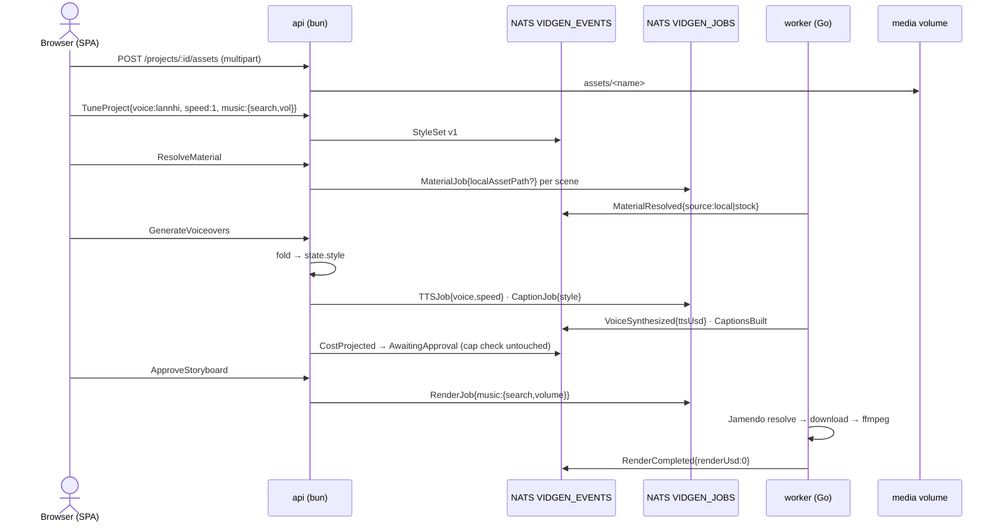

# Resource + Tune in the webapp, then CLI removal (P5) — design

Date: 2026-07-10
Status: approved by user (brainstorming session), spec pending user review
Branch: `feat/p5-resource-tune-cli-removal`

## Problem

The webapp migration (P1–P4, merged) dropped two CLI capabilities:

1. **`--resource <dir>`** — seed scenes with local media before stock search.
2. **`tune`** — pick voice, speech speed, caption font/size, background music
   (search + volume).

The worker is already plumbed for both (`TTSJob.Voice/Speed`,
`CaptionJob.Style`, `RenderJob.Music`, `MaterialJob.LocalAssetPath`) but the
api never fills those fields and no command exists to set them. P5 (CLI
deletion) is gated on restoring this parity first — deleting the CLI now
would lose the only way to use these features.

## Ratified frame (OKR — human-owned, frozen)

- **Objective:** 1 successful **browser-only** docker E2E render where
  (a) a locally uploaded asset appears as `MaterialResolved{source:'local'}`,
  (b) a non-default voice/speed/caption/music is visible in the actual NATS
  job payloads — **and** `cmd/vidgen` + `internal/cli` + root
  `go.mod`/`go.sum` deleted with `go test ./worker/...` and `bun test` green.
- **Wall 1 (cost, tripwire):** per-project Σ `VoiceSynthesized.ttsUsd` ≤
  `COST_CAP_USD` (user-configurable, default 0.15), read directly from the
  event store; E2E total spend ≤ 2× configured cap; cost-enforcement code
  never touched or weakened.
- **Wall 2 (contract, tripwire):** exactly **one** contract change is
  authorized — the `TuneProject` command + `StyleSet` event described below,
  landed with spec + index update + C3 change-unit in the same PR. Any
  further event/command drift = halt and ask.
- **Wall 3 (regression, drift):** `go test ./worker/...` + `bun test` green
  at every commit.
- No-cascade rule: success is read from the world (mp4 on volume, job
  payloads, event-store sums), never from "tasks done".
- Flags: *cannot* (E2E blocked), *breaking* (wall trip), *pointless* (UI/api
  built but payloads still default — the highest-risk trap here).
- Goal-switching is the user's call only.

## Design

### 1. Contract change (the one authorized)

**Command** `TuneProject(projectId, input)`:

```ts
type TuneInput = {
  voice?: string        // one of the 7 FPT voices (worker domain.AllVoices)
  speed?: number        // -3..+3 (worker domain.Speed)
  captionStyle?: { fontName: string; fontSize: number }
  music?: { search: string; volume: number } | null // Jamendo search, vol 0..1; null clears
}
```

- Validation mirrors worker `internal/domain`: voice ∈ {banmai, thuminh,
  lannhi, linhsan, leminh, giahuy, myan}, speed ∈ [-3, 3], volume ∈ (0, 1].
- Allowed in any status **before** `ApprovalGranted`; rejected after
  (approved/rendered/published) — approval freezes the storyboard.
- Repeatable. Partial input merges over the current folded style (unset
  fields keep their current/default value); the emitted event is always a
  **full** snapshot, so replay never depends on merge logic.
- Explicit music removal: `music: null` in input clears music (distinct from
  omitting the field).

**Event** (appended to the catalogue, v:1 like the rest):

```ts
{ v: 1; type: 'StyleSet'; projectId: string; at: string;
  voice: string; speed: number;
  captionStyle: { fontName: string; fontSize: number };
  music: { search: string; volume: number } | null }
```

- Full snapshot, last-write-wins on replay (fold keeps the latest).
- Nats-Msg-Id scheme: `StyleSet-<projectId>--` is **wrong** for a repeatable
  event (it would dedupe re-tunes). Use
  `StyleSet-<projectId>-<eventUlid>` — uniqueness per emission, idempotent
  per publish attempt.

**Fold** — `ProjectState` gains:

```ts
style: {
  voice: string; speed: number;
  captionStyle: { fontName: string; fontSize: number };
  music: { search: string; volume: number } | null
}
```

Defaults (when no StyleSet ever emitted) — mirrors CLI defaults
(`internal/flow/flow.go:120-131`): `voice:'banmai'`, `speed:0`,
`captionStyle:{fontName:'Arial', fontSize:64}`, `music:null`.

TuneInput exposes only fontName/fontSize (CLI parity — `--caption-font`,
`--caption-size`). The remaining `domain.CaptionStyle` fields stay at CLI
defaults and are filled by api when building `CaptionJob.Style`:
`Primary:'#FFFFFF'`, `Outline:'#000000'`, `Bold:true`.

**Docs updated in the same PR:** index §4 (event catalogue), §5 (command
set), and one C3 change-unit covering the contract change + P5 topology
(`adr-20260709-webapp-topology`).

### 2. Resource upload (api plumbing — not an event change)

- `POST /projects/:id/assets` — multipart upload, saved to
  `MEDIA_DIR/<projectId>/assets/<sanitized-filename>`.
  - Accept: mp4, mov, jpg, jpeg, png. Max ~100 MB per file.
  - Filename sanitized (no path traversal, no `..`, ASCII-safe).
- `GET /projects/:id/assets` — list uploaded assets (name, size).
- Uploads are file storage like render outputs — **not** events. The event
  trail records their use via the existing
  `MaterialResolved{source:'local', assetPath}`.

### 3. Material assignment (CLI `--resource` parity)

`resolveMaterial` command: uploaded assets are assigned to scenes in upload
order (scene 0 ← first asset, …); scenes beyond the asset count fall back to
stock search as today. Assigned scenes get
`MaterialJob{localAssetPath: <volume path>}`; the worker's existing material
handler short-circuits stock search when `localAssetPath` is set and emits
`MaterialResolved{source:'local'}`.

### 4. api fills job payloads (closes the pointless-trap)

- `generateVoiceovers`: fold events → `state.style`; dispatch
  `TTSJob{voice, speed}` and `CaptionJob{style}` from it (today: hardcoded
  `{narration}` only).
- Render dispatch (on approval): `RenderJob.music` filled from
  `state.style.music`.
- `resolveMaterial`: `localAssetPath` per §3.

### 5. Worker: music resolution at render time

- Job payloads are internal (plan decision #7), so extend `RenderMusicJob`
  with `search string`; `path` becomes optional.
- `RenderHandler`: when `search` set and `path` empty, resolve via the
  existing (currently unwired) `internal/music` Jamendo provider, download to
  the media volume, probe duration, then render.
- Jamendo is free → `renderUsd` stays 0; cost wall untouched.
- No new event: music remains part of `RenderCompleted`'s work.

### 6. Frontend — Tune panel (build with impeccable skill)

On the project page, editable while status < approved:

- Voice select — 7 voices labeled by region/gender (e.g. "banmai — northern
  female").
- Speed slider (-3..+3, default 0).
- Caption font name + size inputs.
- Music: search text + volume slider; empty search = no music.
- Asset dropzone: upload → list with name/size; wired to `POST /assets`.
- Zustand store: `tuneProject(input)`, `uploadAssets(files)`,
  `fetchAssets()`; style displayed from the projected/folded state so the UI
  shows what the event log says, not local optimism.
- Panel disabled (read-only) once approved.

### 7. Testing

- **api (bun:test):** TuneProject validation table (voices, speed bounds,
  status gating); fold with 0/1/n StyleSet events (last wins); payload
  filling asserts TTSJob/CaptionJob/RenderJob carry style; upload route
  (sanitization, type/size rejects); material assignment order.
- **worker (go test):** render handler music resolution with mocked provider
  (table-driven); `RenderMusicJob` decode with `search`/`path` variants.
- **E2E gate (ratified):** full docker stack; browser-only run uploading
  1 asset, picking non-default voice + music search; verify by direct read:
  NATS job payloads carry the choices, event store shows
  `MaterialResolved{source:'local'}` and Σ ttsUsd ≤ cap, mp4 exists on the
  media volume.

### 8. CLI removal (original P5, unchanged order)

Only after the E2E gate passes:

1. Delete `cmd/vidgen`, `internal/cli`, and the rest of the root Go module
   (root `go.mod`/`go.sum` and remaining root `internal/` packages that only
   the CLI used).
2. README + CLAUDE.md sync (webapp-only usage).
3. C3 change-unit `adr-20260709-webapp-topology` (covers contract change +
   topology; `.c3/` never hand-edited).

## Flow



## Out of scope

- Re-tune after approval (approval freezes the storyboard).
- Per-scene voice or multiple music tracks.
- Asset management beyond upload + list (no delete/reorder UI).
- Publish path in E2E (no TIKTOK_ACCESS_TOKEN — skipped).

## Risks

- **Pointless trap:** UI/commands land but payloads stay default — mitigated
  by payload-filling tests + E2E direct payload read.
- **Music provider unwired:** first real use of `worker/internal/music`;
  Jamendo key (`JAMENDO_CLIENT_ID`) present in `.env`; mocked in unit tests,
  exercised in E2E.
- **Msg-Id dedupe of re-tunes:** addressed by per-emission ULID in the
  StyleSet msg id (see §1).
