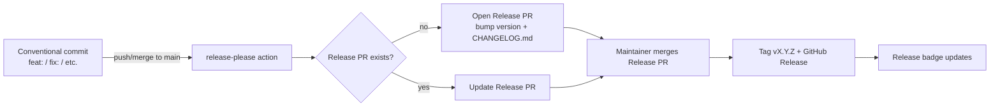

# Design — Docs Refresh + Release Automation

**Date:** 2026-07-22
**Repo:** `cuongtranba/video-generation-skill` (vidgen)
**Status:** approved, ready for implementation plan

## Goal

Bring the repo's documentation and release process up to production quality:

1. **README** — full rewrite with status badges and deeper reference sections.
2. **CLAUDE.md** — sync with the rewritten README; add a release-process note.
3. **CI status badges** — CI, latest release, tech stack, license, shown at the top of the README.
4. **release-please** — automated versioning + CHANGELOG + GitHub Releases, single root tag.
5. **LICENSE** — MIT (needed for the license badge).

Architecture facts are **frozen in C3** and are only *documented* here, never changed. The README's
architecture section reflects the C3 topology verified on 2026-07-22 (system `c3-0`; containers `c3-10`
api, `c3-20` worker, `c3-30` frontend; 27 components).

## Decisions (locked)

| Decision | Choice | Rationale |
|---|---|---|
| Release strategy | **Single root release** (`release-type: simple`) | Ships as one docker-compose app; components aren't published/consumed independently. One version, one tag (`vX.Y.Z`), one `CHANGELOG.md`. |
| Badges | CI status, latest release, tech stack, license | Communicates health + stack at a glance. |
| README depth | **Full rewrite** | Restructure top-to-bottom with new reference sections. |
| License | **MIT** | Permissive; `Copyright (c) 2026 cuong.tran`. |
| Seed version | `1.0.0` → first tag `v1.0.0` | Matches `api/package.json` version; repo is post-P5, feature-complete. |

## Deliverables

### 1. `LICENSE` (new)
Standard MIT text, `Copyright (c) 2026 cuong.tran`.

### 2. `README.md` (full rewrite)
Section order:

1. **Title + badges row** — CI status · latest release · Bun · Go 1.25 · React/Vite · NATS · Postgres · License MIT.
2. **Hero** — one-line pitch + the existing idea→MP4 ASCII example block (kept, it's good).
3. **Architecture**
   - Refreshed mermaid flowchart (3 containers over NATS + Postgres).
   - **Component inventory table** — 27 components grouped by container (id, name, one-line responsibility), sourced from the C3 model.
   - Event-sourced flow paragraph + cost-wall paragraph.
4. **Quick start** — `.env` secrets, Agent SDK auth (OAuth token or API key), `docker compose up --build`, then the curl-driven pipeline walkthrough (kept, tightened).
5. **Command API reference** — table of every `POST /api/commands/*`, asset upload `POST /api/projects/:id/assets`, `GET /api/state`, `GET /api/config`.
6. **Event catalogue** — table of the frozen `VidgenEvent` union: command → emitted events (`MaterialResolved`, `VoiceSynthesized`, `CaptionsBuilt`, `RenderCompleted`, `RunFailed`, `CostProjected`, `StyleSet`, etc.). Note it is mirrored verbatim in `frontend/src/store/events.ts` and matched by the worker structs.
7. **Tune** — the `StyleSet` field table (voice/speed read-only under ElevenLabs, captionStyle, music).
8. **Providers** — `config.yaml` matrix (tts/material/music/videogen/publish) + provider table.
9. **Project layout** — directory tree: `api/`, `worker/`, `frontend/`, `.c3/`, `.github/`, `rules/`, `docs/`.
10. **Development** — per-service test/lint/typecheck commands, ast-grep gates, the four CI jobs.
11. **Release process** — Conventional Commits → release-please Release PR → merge → tag + Release. Short.
12. **License** (MIT) + **Attribution** (Pexels/Pixabay/Jamendo).

**Accuracy constraints (do not regress — from CLAUDE.md gotchas):**
- ElevenLabs is the only TTS provider; voice/speed are read-only labels, not pickers.
- Cost wall `Σ VoiceSynthesized.ttsUsd ≤ COST_CAP_USD` (default $0.15) — never weaken wording.
- Approval gate: `ApproveStoryboard` 400s until every scene has voiceover + material + `captionsReady`.
- `dispatchJob` does no key remapping (payload keys == worker json tags).

### 3. `CLAUDE.md` (sync)
- Add a **Release** subsection under Commands or Workflow: release-please, single root tag, Conventional Commits required for automated versioning; how to cut a release (merge the Release PR).
- Add a one-line note that the repo is MIT-licensed and carries CI/release badges.
- Reconcile any wording that drifts from the rewritten README. **No architecture-fact edits** (frozen in C3).

### 4. `release-please-config.json` (new)
```json
{
  "$schema": "https://raw.githubusercontent.com/googleapis/release-please/main/schemas/config.json",
  "packages": {
    ".": {
      "release-type": "simple",
      "changelog-path": "CHANGELOG.md",
      "include-component-in-tag": false,
      "bump-minor-pre-major": false
    }
  }
}
```

### 5. `.release-please-manifest.json` (new)
```json
{ ".": "1.0.0" }
```

### 6. `.github/workflows/release-please.yml` (new)
- Trigger: `push` to `main`.
- `permissions: { contents: write, pull-requests: write }`.
- Single job using `googleapis/release-please-action@v4` with
  `config-file: release-please-config.json` and `manifest-file: .release-please-manifest.json`.
- Exact action inputs verified against **Context7** (`googleapis/release-please`) before writing.

## Release flow



## Badges (exact)

Repo slug: `cuongtranba/video-generation-skill`.

| Badge | Source |
|---|---|
| CI status | `img.shields.io/github/actions/workflow/status/cuongtranba/video-generation-skill/test.yml?branch=main&label=CI` |
| Latest release | `img.shields.io/github/v/release/cuongtranba/video-generation-skill?label=release` |
| Bun | static shield (api/frontend runtime) |
| Go | `img.shields.io/github/go-mod/go-version/cuongtranba/video-generation-skill?filename=worker/go.mod` |
| React / Vite | static shields |
| NATS / Postgres | static shields |
| License | `img.shields.io/github/license/cuongtranba/video-generation-skill` |

## Out of scope

- Per-component (api/worker/frontend) independent versioning.
- Publishing packages to any registry (npm/Go module proxy) — release-please only tags + changelogs.
- Docker image publishing on release (could be a follow-up; not requested).
- Changing any frozen C3 architecture fact.

## Workflow constraints

- All work in a **git worktree** off `main`; branch `docs/readme-release-automation`; PR to merge (CLAUDE.md rules #5, #8).
- Verify release-please-action v4 config via **Context7** before writing the workflow (rule #6).
- No code changes to api/worker/frontend — docs + CI config + LICENSE only.
