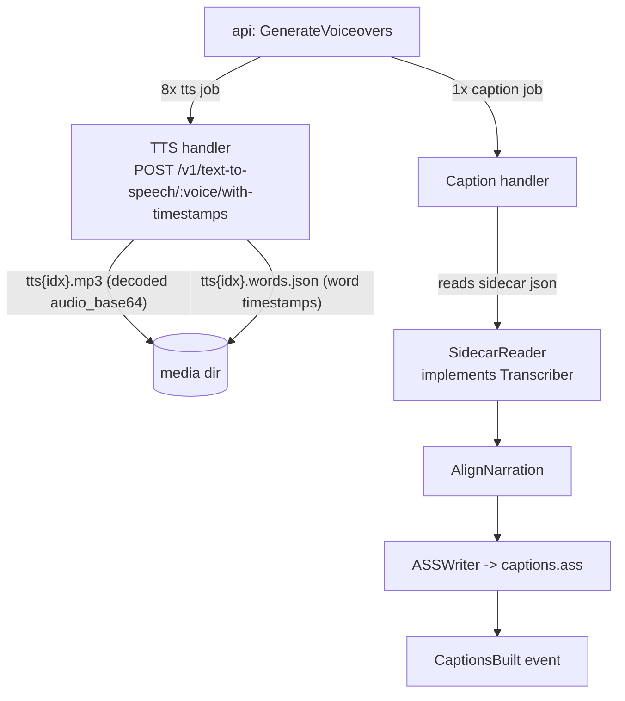

# Replace Whisper with ElevenLabs synthesis timestamps

**Date:** 2026-07-22
**Status:** Approved
**Scope:** worker only (api, frontend, event/job catalogue unchanged)

## Problem

Captions are built by running the `openai-whisper` CLI over each scene's TTS
mp3 to recover word-level timestamps. This is the slowest, most expensive step
in the pipeline:

- ~2–6 minutes of CPU-bound transcription per project (~660% CPU observed in
  production), gating `ApproveStoryboard` on `captionsReady`.
- ~1–2 GB of the worker image is the whisper install + model.
- The transcription re-derives information ElevenLabs already knows: the
  synthesis engine decides word timing when it generates the audio.

ElevenLabs' `POST /v1/text-to-speech/{voice_id}/with-timestamps` returns the
audio **plus character-level timestamps in the same call at no extra cost**
(same characters billed). Verified against current docs (Context7,
2026-07-22): response is `{audio_base64, alignment: {characters,
character_start_times_seconds, character_end_times_seconds},
normalized_alignment}`.

## Decision

Approach A — synthesize with timestamps, persist a sidecar file, and have the
caption handler read sidecars instead of running whisper. Whisper is deleted
entirely (code, tests, Docker install). No fallback: ElevenLabs timestamps are
produced by the same call that produces the audio, so there is no scenario
where the audio exists but timestamps were unavailable at synthesis time.

## Data flow



Unchanged: api command handlers and job dispatch, frozen event catalogue
(`VoiceSynthesized`, `CaptionsBuilt` shapes), frontend, render handler. The
caption job still exists and still emits `CaptionsBuilt`; only its timestamp
source changes.

## Component changes

| File | Change |
|---|---|
| `worker/internal/tts/elevenlabs.go` | Call `…/with-timestamps` with `Accept: application/json`; decode `audio_base64` → mp3 at `destPath` (unchanged); convert character alignment → word-level timestamps (`wordsFromAlignment`, group by whitespace); write `tts{idx}.words.json` next to the mp3 |
| `worker/internal/tts/provider.go` | `SynthesizeResult` gains `WordsPath string` (empty ⇒ provider produced no timestamps) |
| `worker/internal/caption/sidecar.go` (new) | `SidecarReader` implements the existing `Transcriber` interface: maps `audioPath` → sibling `.words.json`, returns `[]WordTimestamp`. Missing file ⇒ error |
| `worker/internal/caption/whisper.go` + test | Deleted. `WordTimestamp` moves to `align.go` |
| `worker/cmd/worker/main.go` | Wire `caption.NewSidecarReader()` in place of `NewWhisperRunner(whisperBin)`; drop `WHISPER_BIN` |
| `worker/Dockerfile` | Remove `pip install openai-whisper` and `WHISPER_BIN` env |

### Sidecar format (`tts{idx}.words.json`)

```json
{ "words": [ { "word": "Xin", "start": 0.0, "end": 0.31 }, … ] }
```

Written atomically (temp file + rename) so the caption handler never reads a
half-written sidecar.

### Char → word grouping (`wordsFromAlignment`)

Pure function in the tts package. Groups consecutive non-whitespace characters
into words; a word's `start` is its first char's start, `end` its last char's
end; whitespace characters are separators only. Uses the **non-normalized**
`alignment` field (matches the literal narration text the caption aligner
expects). Falls back to `normalized_alignment` when `alignment` is null.

## Error handling

- **Alignment missing/empty in the API response:** TTS still succeeds (mp3
  written, `VoiceSynthesized` emitted) but no sidecar is written; the caption
  job then fails with a clear `RunFailed` ("sidecar not found") instead of
  producing drifting captions.
- **Caption-before-TTS race** (exists today; whisper crashed on missing mp3):
  `SidecarReader` errors on a missing sidecar → the caption handler returns
  the error → `Nak()` → JetStream redelivers until all sidecars exist. The
  race now converges instead of failing the run.
- **Old projects** (mp3s without sidecars, synthesized before this change):
  captions fail with "sidecar not found". Accepted; such projects re-run
  voiceovers to regenerate.
- HTTP/402/4xx handling and the 60s client timeout are unchanged.

## Testing (TDD, targeted suites)

- `worker/internal/tts`: table-driven `wordsFromAlignment` tests (Vietnamese
  diacritics, multiple/leading/trailing spaces, empty alignment, null
  alignment falling back to normalized); `httptest` server returning canned
  `/with-timestamps` JSON → assert mp3 bytes, sidecar content, `WordsPath`.
- `worker/internal/caption`: `SidecarReader` happy path + missing-file error;
  existing `AlignNarration`/`ASSWriter` tests unchanged.
- `worker/internal/jobhandler`: existing caption handler tests keep passing
  (they fake `Transcriber`; the interface is unchanged).
- Gates: `go build ./...`, `go vet ./...`, targeted suites
  (`go test ./internal/jobhandler/... ./internal/render/... ./internal/tts/...
  ./internal/caption/...`).
- Live verification before claiming success: deploy, drive
  create→script→material→voiceovers, confirm `captionsReady` lands within
  seconds and a full render completes with burned captions.

## Docs & C3

- C3 change-unit records the whisper→sidecar swap (whisper appears in frozen
  caption-component facts and gotchas).
- README pipeline description and badges section reviewed for whisper
  mentions; `CLAUDE.md` gotchas updated ("whisper ~2-3 min" note replaced with
  the sidecar design and the ffmpeg/libass note retained).

## Non-goals

- No change to the tune model (`voice`/`speed` fields remain unapplied).
- No caption-stage removal (approach B rejected: frozen catalogue churn).
- No forced-alignment API usage (approach C rejected: extra billed calls).
- No fallback transcriber.
